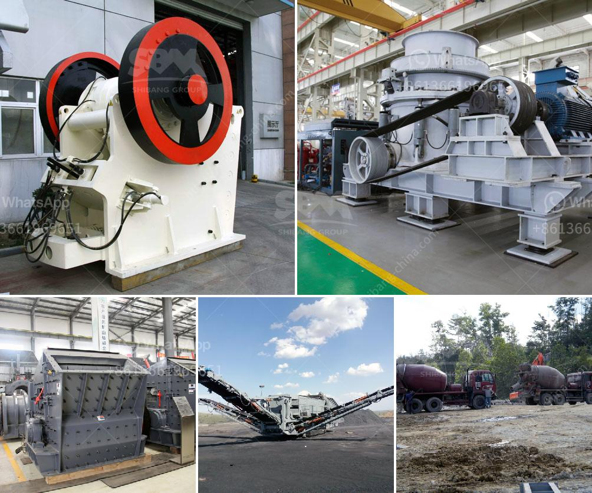

<h3>100 mt hr stone crusher machine</h3>
In recent years, there has been a rapid growth in the industrial sector. With the increasing demand for construction materials and building stones, the need for stone crushers is also rising. These machines are utilized in a variety of sectors such as mining, metallurgy, building materials, and highways to carry out the crushing of rocks, stones, and other hard materials.

One particular type of stone crusher machine, known as a jaw crusher, utilizes compressive force to break down and crush hard materials. In this machine, an eccentric shaft is attached to a fixed jaw plate. As the motor rotates, a flywheel is utilized to store kinetic energy and transfer it to the movable jaw, which then moves back and forth to crush the stones.

The 100 mt/hr stone crusher machine is an efficient and versatile machine that is capable of crushing a variety of materials ranging from stones that are less than 30cm in diameter to rocks that are more than 100cm in diameter. It has a maximum production capacity of 750t/h.

The 100 mt/hr stone crusher machine is powered by a 215 HP motor. This machine is incorporated with a special transmission system so that it can run at a smooth and consistent speed. The machine is suitable for construction and road building industries.

The 100 mt/hr stone crusher machine comes with a magnetic separator to separate metals from stones. This machine is easy to install and requires less maintenance. It is compact and easy to operate. The machine comes with a PLC control system that allows for automatic operation with adjustable speed control and multiple crushing modes.

One of the main advantages of the 100 mt/hr stone crusher machine is its exceptional fuel efficiency. It consumes less fuel, which means lower operating costs. This machine also produces less noise, making it environmentally friendly.

To ensure the smooth operation of the 100 mt/hr stone crusher machine, regular maintenance and inspections are required. Lubrication of key parts, such as the bearings, is essential to prevent friction and prolong the machine's lifespan. Regular cleaning of the machine and the removal of any blockages are also important to maintain optimal performance.

In conclusion, the 100 mt/hr stone crusher machine is a versatile and efficient machine that satisfies the crushing needs of various industries. With its exceptional fuel efficiency and low operating costs, it is an ideal choice for businesses looking to increase their productivity and reduce their environmental impact. Regular maintenance and inspections are necessary to ensure the smooth operation of the machine and prolong its lifespan.
<h3>Contact us</h3><ul><li><strong>Whatsapp:&nbsp;<a href="https://wa.me/8613661969651">+8613661969651</a></strong></li><li><a href="https://swt.shibang-china.com/?git&amp;zhl&amp;100 mt hr stone crusher machine"><strong>Online Service(chat now)</strong></a></li></ul><h3>Related</h3><ul><li><a href='salt machinery manufacturers india price.md'>salt machinery manufacturers india price</a></li><li><a href='distributor stone crusher in guatemala.md'>distributor stone crusher in guatemala</a></li><li><a href='mobile stone crusher plant south africa.md'>mobile stone crusher plant south africa</a></li><li><a href='used gupsum board plant sale.md'>used gupsum board plant sale</a></li><li><a href='vibrating grinding mill ball china.md'>vibrating grinding mill ball china</a></li></ul>