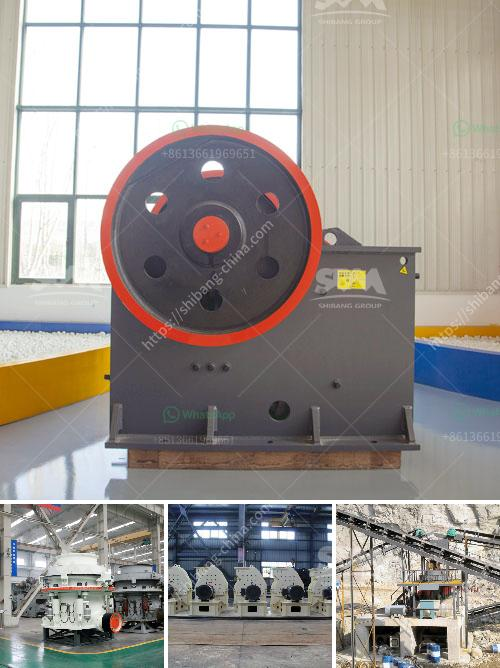

<h3>100 tons hour gold wash plant</h3>
The mining industry is continuously evolving, with innovations and new technologies being introduced to increase efficiency and productivity. One such innovation is the 100 tons per hour gold wash plant, designed to help mining companies extract gold in large quantities.

The gold wash plant is a state-of-the-art machine designed to separate gold particles from soil or sediment, enabling mining companies to easily recover gold in large quantities. This plant can process up to 100 tons of material per hour, making it a powerful tool for large-scale gold mining operations.

The key component of the gold wash plant is the trommel, a cylindrical drum with perforated metal walls. The trommel rotates, allowing water and heavily sedimented material to flow into it. As the material flows, it is subjected to various stages of sorting and washing.

At the initial stage, the larger rocks and debris are separated from the rest of the material, ensuring that only fine particles and gold-rich sediment are processed further. This screening process helps prevent the trommel from becoming clogged and ensures a smoother operation.

The next stage involves the use of water jets that wash the material, removing any remaining dirt and clay. This process helps to break up the material, allowing the gold particles to be released and separated from the rest of the sediment.

Once washed, the material is passed through a series of concentrators. These concentrators employ gravity separation techniques to further refine the gold particles. The heavier gold particles sink to the bottom, while lighter particles are carried away by water. This step ensures that the final product is highly concentrated in gold, making it easier for mining companies to extract it.

The 100 tons per hour gold wash plant is also equipped with efficient water recycling systems. This ensures that water, a valuable resource, is not wasted and can be reused in the washing process. The plant is designed to operate continuously, minimizing downtime and maximizing gold extraction.

In addition to its efficiency, this gold wash plant is also designed with sustainability in mind. It is built with robust materials to withstand the harsh conditions of mining operations, ensuring its longevity. Furthermore, the plant is designed to minimize its environmental impact by using greener technologies and reducing water and energy consumption.

The 100 tons per hour gold wash plant is a testament to the continuous innovation of the mining industry. With its high processing capacity and efficient design, it enables mining companies to extract gold in large quantities, maximizing their profits.

In conclusion, the 100 tons per hour gold wash plant is a game-changer for the mining industry. Its efficiency, sustainability, and high processing capacity make it an invaluable asset for large-scale gold mining operations. With the help of this innovative technology, mining companies can extract gold in large quantities, ensuring a prosperous and productive future for the industry.
<h3>Contact us</h3><ul><li><strong>Whatsapp:&nbsp;<a href="https://wa.me/8613661969651">+8613661969651</a></strong></li><li><a href="https://swt.shibang-china.com/?git&amp;zhl&amp;100 tons hour gold wash plant"><strong>Online Service(chat now)</strong></a></li></ul><h3>Related</h3><ul><li><a href='iron crushing machine cost.md'>iron crushing machine cost</a></li><li><a href='layoutde a crusher machine.md'>layoutde a crusher machine</a></li><li><a href='200mm crusher sieve opening sizes.md'>200mm crusher sieve opening sizes</a></li><li><a href='list price vibrating screen.md'>list price vibrating screen</a></li><li><a href='dealer of steel balls for ball mill in manila.md'>dealer of steel balls for ball mill in manila</a></li></ul>