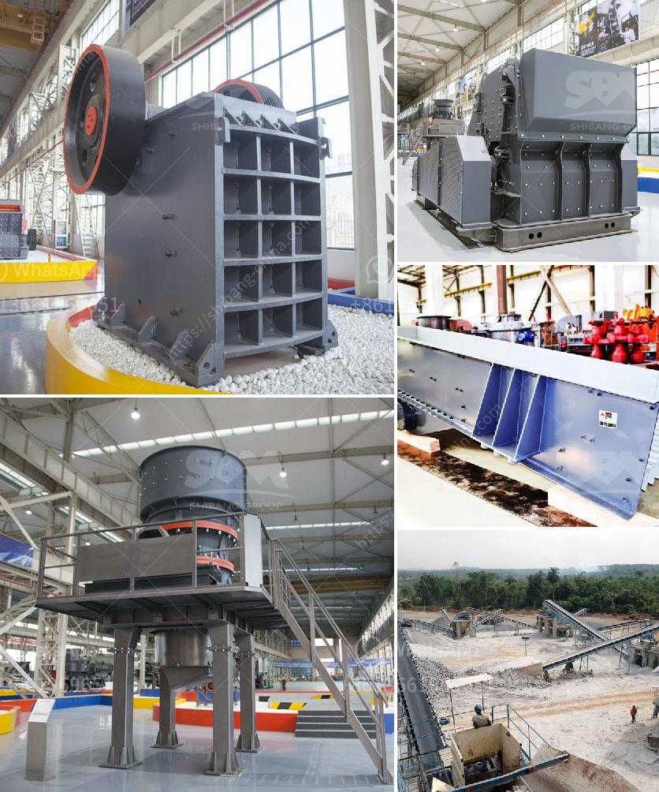

<h3>100 tph cone crusher price</h3>
The cone crusher is a versatile crushing machine that is used in many industries, including mining, construction, and demolition. It has a larger capacity compared to other crusher models. It ensures the crushing of different types of raw materials into smaller, manageable sizes.

When shopping for the cone crusher, you will notice that there are different models, with varying capacities. One popular model is the 100 tph cone crusher. This crusher operates on a moderate-speed and is equipped with a cavity design that ensures excellent productivity. It is renowned for its high-quality end products, and its ability to produce a uniform particle size.

When considering the purchase of a 100 tph cone crusher, one of the most important factors to consider is the price. The price of the cone crusher may vary depending on factors such as the model, specifications, and the manufacturer. It is essential to compare different models and manufacturers to get the best price possible.

The price of a 100 tph cone crusher can range from $10,000 to $50,000 or more. This is dependent on the model, specifications, and manufacturer. Factors that influence the price include the size of the machine, the type of technology used, and the production capacity.

In addition to the purchase price, it is also important to consider the operational cost of the cone crusher. This includes factors such as energy consumption, maintenance, and parts replacement. It is important to choose a cone crusher that is energy-efficient and requires minimal maintenance to keep operational costs low.

Another factor to consider when purchasing a cone crusher is the after-sales service provided by the manufacturer. A reputable manufacturer will offer excellent customer support, including technical assistance, spare parts availability, and maintenance services. It is crucial to choose a manufacturer that has a good reputation for providing reliable after-sales service.

The 100 tph cone crusher is an investment that should be taken seriously. It is important to research different models and manufacturers, compare prices, and consider operational costs before making a final decision. Choosing the right cone crusher can greatly impact productivity and profitability.

In conclusion, the 100 tph cone crusher is a versatile and powerful crushing machine that offers excellent productivity and high-quality end products. The price of this crusher may vary depending on factors such as the model, specifications, and the manufacturer. It is crucial to compare prices, consider operational costs, and choose a reputable manufacturer that offers excellent after-sales service. Taking these factors into consideration will ensure that you make an informed decision and find the best 100 tph cone crusher for your specific needs.
<h3>Contact us</h3><ul><li><strong>Whatsapp:&nbsp;<a href="https://wa.me/8613661969651">+8613661969651</a></strong></li><li><a href="https://swt.shibang-china.com/?git&amp;zhl&amp;100 tph cone crusher price"><strong>Online Service(chat now)</strong></a></li></ul><h3>Related</h3><ul><li><a href='quarry plant equipments and costs.md'>quarry plant equipments and costs</a></li><li><a href='crusher plant for quartz crushing.md'>crusher plant for quartz crushing</a></li><li><a href='150 tph mobile jaw crusher for sale in malaysia.md'>150 tph mobile jaw crusher for sale in malaysia</a></li><li><a href='vertical roller mill gearboxes.md'>vertical roller mill gearboxes</a></li><li><a href='machine that crushes stones to ballast.md'>machine that crushes stones to ballast</a></li></ul>