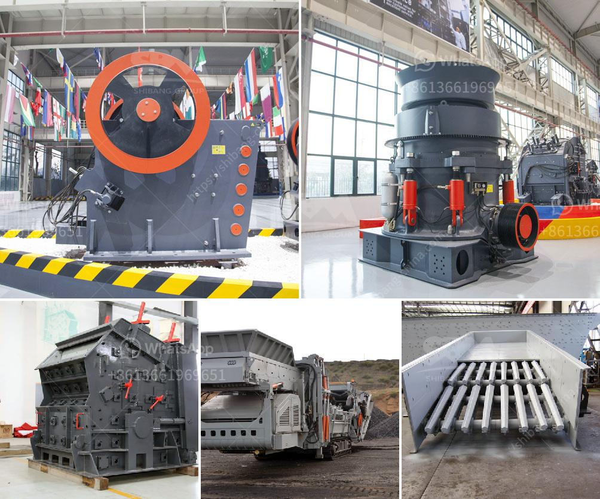

<h3>100 tph stone crusher</h3>
The advancement in technology and the progress machinery industry has seen a steady growth in the market for crushed stone aggregates. Stone crushers are significant machines that perform the task of crushing stones with efficiency and precision. They are equipped with a heavy-duty motor that helps them pulverize stones into small particles effortlessly. The market is flooded with several types of stone crushers, one of which is the 100 tph stone crusher.

The 100 tph stone crusher is a necessary equipment for primary crushing in the mining industry. It is used to break large stones into small pieces, so that they can be transported easily. This type of crusher is commonly used on construction sites and in stone quarries to crush large stones into smaller pieces. Crushed stone has a variety of purposes but is often used to make level surfaces, provide drainage under roads and buildings, or to create gravel roads.

The 100 tph stone crusher operates by a fixed jaw plate and a moving jaw plate. It is applied to crush materials whose size cannot be more than 500mm. In general, jaw crusher is applied to crushing less than 320Mpa. The discharge size is adjusted from 50mm to 100mm.

The jaw crusher has features of simplicity, easy access and low maintenance. Primary crushing machine--jaw crusher is economical machine for the first crushing stage. It is widely used in mining crushing process, construction waste recycling, waste concrete recycling, limestone quarrying, and cement production line, etc. According to the feeding size, jaw crusher can be divided into three types: Large-size, medium-size and small-size with respective feeding sizes 600mm, 300mm-600mm, and 300mm.

The stone crushers are capable of crushing capacity ranging from 100 TPH to 200 TPH. The stone crushers can be easily operated in both mobile and fixed stone crushing plants. Their applications and advantages in construction and mining industries make them highly sought after.

The 100 tph stone crusher is equipped with advanced technologies to ensure that the productivity, safety, and efficiency of the machine are at their highest levels. It has an increased production capacity of 50 to 100 percent compared to traditional crushers. It requires less maintenance and ensures higher productivity. Additionally, it offers precise product sizing and minimal fines generation.

In conclusion, the 100 tph stone crusher has several features that make it ideal for crushing large stones into small pieces. It is an essential piece of equipment for stone crushing purposes and is widely used in mining, quarrying, construction, recycling, and other industries. The equipment has a stable performance, economical operation cost, and high crushing ratio. Whether for large-scale stone processing or small-scale construction sites, the 100 tph stone crusher is an ideal choice.
<h3>Contact us</h3><ul><li><strong>Whatsapp:&nbsp;<a href="https://wa.me/8613661969651">+8613661969651</a></strong></li><li><a href="https://swt.shibang-china.com/?git&amp;zhl&amp;100 tph stone crusher"><strong>Online Service(chat now)</strong></a></li></ul><h3>Related</h3><ul><li><a href='jaw crusher price south africa.md'>jaw crusher price south africa</a></li><li><a href='sells crushing plant in osorno.md'>sells crushing plant in osorno</a></li><li><a href='grinding lm vertical mill.md'>grinding lm vertical mill</a></li><li><a href='price of gypsum plant.md'>price of gypsum plant</a></li><li><a href='processing of bauxite ore.md'>processing of bauxite ore</a></li></ul>