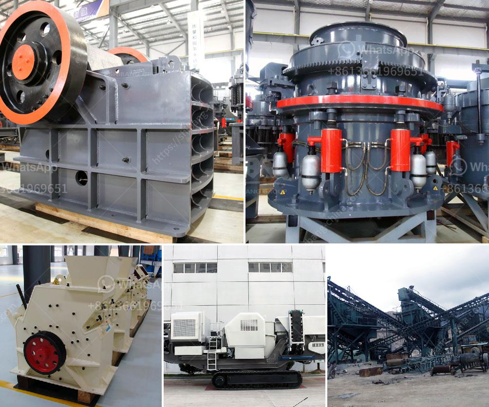

<h3>100tpd crusher plant</h3>
A crusher plant is a machinery that is used to crush various types of rocks into smaller, more manageable sizes. The plant itself consists of several components, such as a feeder, vibrating screen, jaw crusher, impact crusher, and cone crusher.

One type of crusher plant that is commonly used is called a 100 TPD crusher plant. This plant is designed to crush and grind rocks and minerals into smaller pieces, making them easier to be transported and used for various purposes. The term "TPD" refers to tonnes per day, meaning that the plant has a capacity of crushing 100 metric tonnes of rock per day.

A 100 TPD crusher plant is ideal for small-scale mining operations, as it offers reliable and efficient crushing capabilities, all at an affordable cost. It is suitable for crushing various types of rocks, such as limestone, granite, basalt, and more. The plant can produce different sizes of crushed rocks depending on the requirements and preferences.

In addition to the crushing capacity, a 100 TPD crusher plant also has a screening system. The screening system allows the crushed rocks to be classified into different sizes, which can be used for different applications. For example, smaller rocks can be used for road construction, while larger rocks can be used as building materials.

Overall, a 100 TPD crusher plant is a practical and efficient solution for small-scale mining operations. It combines the benefits of crushing and screening in one plant, making it easier to process rocks and minerals. With its reliable performance and cost-effective operation, this plant is a great investment for mining companies looking to enhance their productivity and profitability.
<h3>Contact us</h3><ul><li><strong>Whatsapp:&nbsp;<a href="https://wa.me/8613661969651">+8613661969651</a></strong></li><li><a href="https://swt.shibang-china.com/?git&amp;zhl&amp;100tpd crusher plant"><strong>Online Service(chat now)</strong></a></li></ul><h3>Related</h3><ul><li><a href='iron ore mining and beneficiation project.md'>iron ore mining and beneficiation project</a></li><li><a href='used crushers for sale nigeria.md'>used crushers for sale nigeria</a></li><li><a href='crushing rock export manufacturers india.md'>crushing rock export manufacturers india</a></li><li><a href='plant layout mini cement plant pdf.md'>plant layout mini cement plant pdf</a></li><li><a href='stone crushing machineries imphal.md'>stone crushing machineries imphal</a></li></ul>