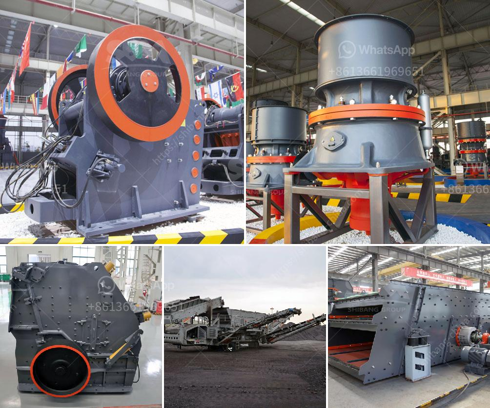

<h3>100tpd slag cement plant</h3>
A slag cement plant is a technological advancement in the cement industry. It not only helps in reducing the environmental pollution caused by the traditional cement manufacturing process but also offers various other benefits. In this article, we will discuss a 100tpd slag cement plant and its significance in the industry.

Slag cement is a byproduct of the steel industry, obtained after the extraction of iron from its ore. It is a granular material that resembles coarse sand and is a combination of silica, alumina, calcium, and other trace elements. Traditionally, slag was dumped into landfills, causing environmental hazards. However, with the advancement of technology, the cement industry has found a way to utilize slag effectively.

A 100tpd slag cement plant is a mid-sized cement plant that produces high-quality slag cement. The term 100tpd denotes the production capacity of the plant, which is 100 tons per day. This size signifies that the plant can produce a significant amount of cement in comparison to small-scale plants. With a 100tpd plant, the cement industry can meet the growing demands of construction without harming the environment.

The key advantage of a 100tpd slag cement plant is its eco-friendliness. Slag cement production reduces carbon dioxide emissions by around 40% compared to traditional cement. It reduces the usage of limestone, a major contributor to CO2 emissions during cement production. Moreover, the utilization of slag, a waste material, reduces the need for quarrying, which protects natural resources.

Apart from contributing to sustainable development, a 100tpd slag cement plant offers economic benefits as well. The availability of slag at low or no cost reduces the overall production cost. It also decreases the reliance on traditional cement components, such as clinker, which are expensive. This, in turn, helps in providing cost-effective solutions to the construction industry.

Furthermore, slag cement has several technical advantages. It offers better long-term strength, increased durability, and resistance to chemical attacks. These properties make it suitable for various applications, including mass concrete structures, marine structures, bridges, and high-performance concrete. Thus, the products manufactured in a 100tpd slag cement plant can meet the diverse requirements of the construction industry.

Implementing a 100tpd slag cement plant requires careful planning and investment. The plant includes various components such as crushers, mills, conveyors, and storage facilities. It also necessitates complying with environmental regulations and obtaining necessary permits. However, with proper management and expertise, the operational and environmental benefits outweigh the challenges.

To conclude, a 100tpd slag cement plant is a significant advancement in the cement industry. It not only addresses the environmental concerns associated with traditional cement production but also offers economic and technical advantages. With the rising demand for sustainable construction materials, such plants have the potential to revolutionize the industry and pave the way for a greener future.
<h3>Contact us</h3><ul><li><strong>Whatsapp:&nbsp;<a href="https://wa.me/8613661969651">+8613661969651</a></strong></li><li><a href="https://swt.shibang-china.com/?git&amp;zhl&amp;100tpd slag cement plant"><strong>Online Service(chat now)</strong></a></li></ul><h3>Related</h3><ul><li><a href='blast furnace slag grinding machine india.md'>blast furnace slag grinding machine india</a></li><li><a href='quartz stone heating machine for sale.md'>quartz stone heating machine for sale</a></li><li><a href='crushing service with peru jaw crusher.md'>crushing service with peru jaw crusher</a></li><li><a href='size of input and output of primary crusher.md'>size of input and output of primary crusher</a></li><li><a href='stone crusher finance project myanmar.md'>stone crusher finance project myanmar</a></li></ul>