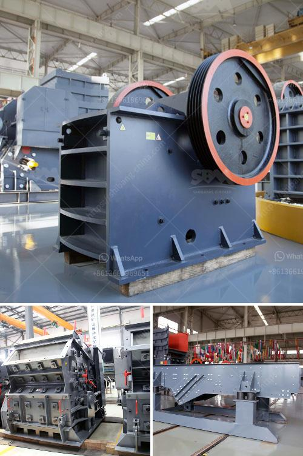

<h3>100tph jaw crusher</h3>
The 100tph jaw crusher is an essential piece of equipment in many industries. It is used across a variety of different industries such as mining, metallurgy, building materials, highways, railways, water conservancy, and chemical industries.

The jaw crusher is used for crushing various materials, such as rocks, ores, and minerals. It compresses it between its jaws in order to break it into smaller pieces. This type of machine is commonly used in the primary crushing process of any material.

One of the key features of the 100tph jaw crusher is its feeding size. It is capable of accepting material up to 500mm in size, making it one of the most versatile jaw crushers on the market. Whether your material is hard or soft, the 100tph jaw crusher will be able to handle it.

Another important feature of the 100tph jaw crusher is its output capacity. This machine is capable of producing up to 280-450 tons per hour of finished product, making it an ideal choice for large-scale operations. With such a high output capacity, it allows you to quickly and efficiently process large quantities of material.

In addition to its high output capacity, the 100tph jaw crusher also offers good energy efficiency. It is designed to use less energy and produce more with every ton of material processed. This makes it a cost-effective choice for companies looking to maximize their productivity while minimizing their overall operating costs.

Overall, the 100tph jaw crusher is a reliable and efficient piece of equipment that offers a high level of performance. Its large feeding size, high output capacity, and good energy efficiency make it an ideal choice for a wide range of applications. Whether you are in the mining industry or any other industry that requires crushing, the 100tph jaw crusher is a reliable and efficient option.
<h3>Contact us</h3><ul><li><strong>Whatsapp:&nbsp;<a href="https://wa.me/8613661969651">+8613661969651</a></strong></li><li><a href="https://swt.shibang-china.com/?git&amp;zhl&amp;100tph jaw crusher"><strong>Online Service(chat now)</strong></a></li></ul><h3>Related</h3><ul><li><a href='design for stone crusher plant.md'>design for stone crusher plant</a></li><li><a href='cone crusher equipment.md'>cone crusher equipment</a></li><li><a href='feldspar crusher impactor.md'>feldspar crusher impactor</a></li><li><a href='quarry equipment for sale in nigeria.md'>quarry equipment for sale in nigeria</a></li><li><a href='ball mill for pigment.md'>ball mill for pigment</a></li></ul>