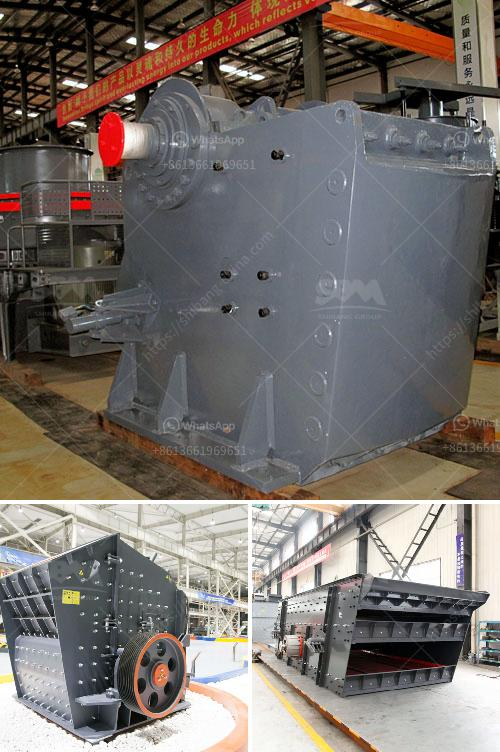

<h3>10tph mobile stone crusher with vibrating screen</h3>
The mobile stone crusher with the capacity of 10 tons per hour is widely used in the quarrying and mining industries. Nowadays, one of the most popular equipment in the mining machinery industry is the mobile stone crusher with the vibrating screen.

The mobile stone crusher with the vibrating screen can be categorized into various types and specifications. The mobile crushing station is a complete mobile screening and crushing plant, which not only includes impact crusher, jaw crusher,  cone crusher, sand making machine, but also incorporates its own vibrating screen. It can process the raw materials with certain particle size into smaller particle size, which makes it have a good crushing effect on quarries and to extract minerals.

The mobile stone crusher with the vibrating screen can be a formidable ally for a contractor. It is versatile and easy to use and install. It can be highly efficient to meet the typical contractor requirements such as sub-grade, surface excavation, utility work, and other applications that require a high level of mobility and flexibility. It can also be used for sorting and screening of construction waste, sand and gravel, and other materials.

The mobile stone crusher with the vibrating screen can be used either as a primary or secondary crushing plant for stone crushing. Features integrated vibrating screen, feeder, belt conveyor, and crushers are all built-in. The mobile stone crusher is an ideal solution for high-purity quarries. It is equipped with a highly efficient vibrating screen and a fully automated system, making it a perfect companion for the large-scale stone crushers.

The mobile stone crusher with the vibrating screen can be widely used in a variety of industries such as mining, construction, smelting, hydropower, and chemical industries, etc. It can crush various materials with hardness not exceeding 320MPa. When the mobile stone crusher is in operation, the pre-crushed raw materials are crushed and processed in the crushing chamber of the machine, then discharged through the discharge port.

The mobile stone crusher with the vibrating screen has the ability to work under any circumstances. It is widely used in the fields of metallurgy, construction, chemical industry,  mining, highway construction, etc. It can process materials on site and has a wide range of applications. The crushed stone materials can be used in road construction, bridge construction, and other infrastructure construction projects.

In conclusion, the mobile stone crusher with the vibrating screen can be used to process many kinds of materials, and it has flexible application. With high efficiency, easy maintenance, and low investment cost, it is favored by quarrying and mining industries. The mobile stone crusher with the vibrating screen is the best choice for small and medium-sized enterprises to expand production scale and improve efficiency.
<h3>Contact us</h3><ul><li><strong>Whatsapp:&nbsp;<a href="https://wa.me/8613661969651">+8613661969651</a></strong></li><li><a href="https://swt.shibang-china.com/?git&amp;zhl&amp;10tph mobile stone crusher with vibrating screen"><strong>Online Service(chat now)</strong></a></li></ul><h3>Related</h3><ul><li><a href='laboratory jaw crusher.md'>laboratory jaw crusher</a></li><li><a href='south africa coal mining cost per ton.md'>south africa coal mining cost per ton</a></li><li><a href='clay powder machine.md'>clay powder machine</a></li><li><a href='balls mill in uk.md'>balls mill in uk</a></li><li><a href='cement manufacturing process flow chart.md'>cement manufacturing process flow chart</a></li></ul>