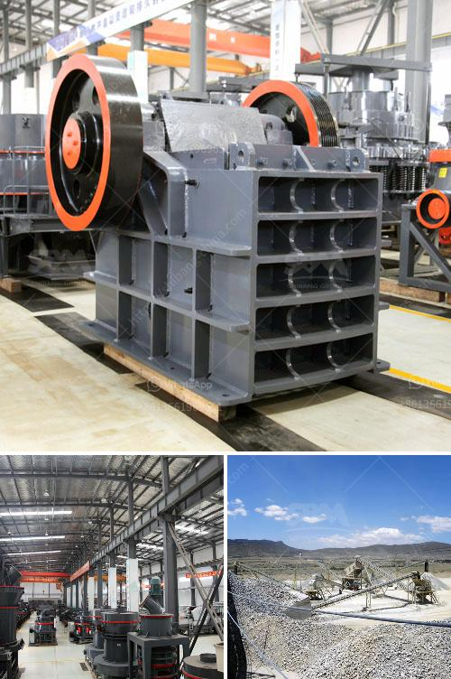

<h3>150 tph mobile jaw crusher for sale in malaysia</h3>
150 tph mobile jaw crusher for sale in malaysia is one of the well-known mining machines manufacturers in China. With the rapid development of mining industry, the demand of stone crushers is increasing. Along with the booming demands of infrastructure construction, there are more and more stone crusher manufacturers attend the mining exhibition in Malaysia. 

Crushing plant for stone and aggregate in malaysia. SBM has designed this widely used 250TPH - 300 TPH stone crushing & screening plant with complete stationary, portable, mobile equipment. This type stone crushing plant is suitable for crushing all kind of rocks, stones, metallic minerals, recycling construction waste and so on.  The production capacity of this one nuit stone crushing plant can achieve 250TPH -300TPH. The features are: high efficiency, low cost, high quality products, low energy consumption and so on.

If you want to know 150 tph mobile jaw crusher for sale in malaysia, please feel free to contact us. SBM is a professional stone crushing machine manufacturer in China. It has been specialized in quarrying and mining industry for long history. We can provide you with complete range of crushing plant including jaw crusher, impact crusher, cone crusher, vsi crusher, vibrating screen etc. SBM engineer can design the stone crushing plant flow chart according to the raw materials. SBM can also offer other different capacity stone crushing screening plant for sale with best price.

In Malaysia, we have a full range of crushing and screening equipment to meet the requirements of customers. At present, our company has developed five models of mobile crushers according to the different needs of customers. They are: PE250*400 jaw crusher, PE400*600 jaw crusher, PE500*750 jaw crusher, PE600*900 jaw crusher, PE750*1060 jaw crusher, PE900*1200 jaw crusher and so on.

In addition, SBM also has mobile stone crusher plant ed for construction waste crushing and recycling, such as mobile jaw crusher plant, mobile cone crusher plant and mobile impact crusher plant with high efficiency, low cost and comfortable service.
<h3>Contact us</h3><ul><li><strong>Whatsapp:&nbsp;<a href="https://wa.me/8613661969651">+8613661969651</a></strong></li><li><a href="https://swt.shibang-china.com/?git&amp;zhl&amp;150 tph mobile jaw crusher for sale in malaysia"><strong>Online Service(chat now)</strong></a></li></ul><h3>Related</h3><ul><li><a href='puzzolana 200 tph cone crushers parts.md'>puzzolana 200 tph cone crushers parts</a></li><li><a href='sandstone crusher.md'>sandstone crusher</a></li><li><a href='machinery used in cement factory.md'>machinery used in cement factory</a></li><li><a href='dolomite lime manufacturers in ghana.md'>dolomite lime manufacturers in ghana</a></li><li><a href='vibrating feeders operating parameters from zenith china.md'>vibrating feeders operating parameters from zenith china</a></li></ul>