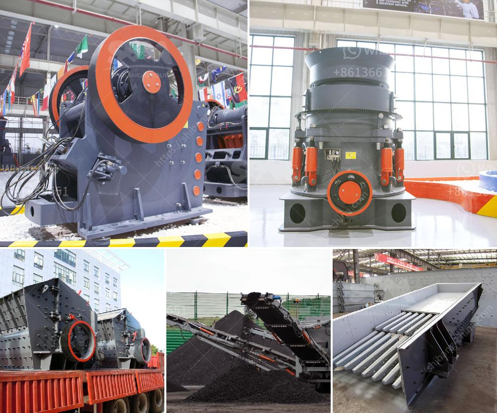

<h3>2 micron limestone grinding unit in india</h3>
Limestone is an important industrial mineral commonly used in the construction industry. It is widely distributed in nature and can be found in various geological formations. In India, limestone is primarily mined in the southern states of Tamil Nadu and Andhra Pradesh. One of the most sought-after uses of limestone is for the production of cement.

To meet the growing demand for limestone in the cement industry, the Indian government has allowed various companies to set up limestone grinding units. These units will provide a crucial raw material for cement manufacturing and will serve as an economic driver for the local communities.

One such grinding unit is the 2 Micron Limestone Grinding Unit in India. This unit uses many advanced technologies and equipment to grind limestone to a two micron top cut size. This allows it to efficiently produce high-quality limestone powder used in various industries, including cement and agriculture.

The grinding unit has a capacity of producing 100 tons of limestone powder per day, which is sufficient to cater to the needs of cement plants, farmers, and other industries in the region. The unit ensures the quality of the limestone powder by employing advanced grinding and classification techniques.

The 2 Micron Limestone Grinding Unit in India is also environmentally conscious. It has taken various measures to minimize its impact on the environment. For instance, it uses state-of-the-art dust control systems to minimize the emission of particulate matter during the grinding process.

Furthermore, the unit has implemented wastewater treatment facilities to treat the water used in the grinding process before its discharge. This ensures that any pollutants present in the water are effectively removed, safeguarding the local ecosystem.

In conclusion, the 2 Micron Limestone Grinding Unit in India is a state-of-the-art facility that strives to meet the needs of industries requiring limestone powder. Its efficient grinding process and focus on environmental sustainability make it a valuable asset for the region. By providing a high-quality raw material, this grinding unit plays a crucial role in supporting India's cement industry and other sectors reliant on limestone.
<h3>Contact us</h3><ul><li><strong>Whatsapp:&nbsp;<a href="https://wa.me/8613661969651">+8613661969651</a></strong></li><li><a href="https://swt.shibang-china.com/?git&amp;zhl&amp;2 micron limestone grinding unit in india"><strong>Online Service(chat now)</strong></a></li></ul><h3>Related</h3><ul><li><a href='what are the prices of crushing equipment.md'>what are the prices of crushing equipment</a></li><li><a href='diamond screening plant for hire south africa.md'>diamond screening plant for hire south africa</a></li><li><a href='hammer mill dimensions.md'>hammer mill dimensions</a></li><li><a href='detail project report on quartz powder plant.md'>detail project report on quartz powder plant</a></li><li><a href='recycled glass price per tonne in durban.md'>recycled glass price per tonne in durban</a></li></ul>