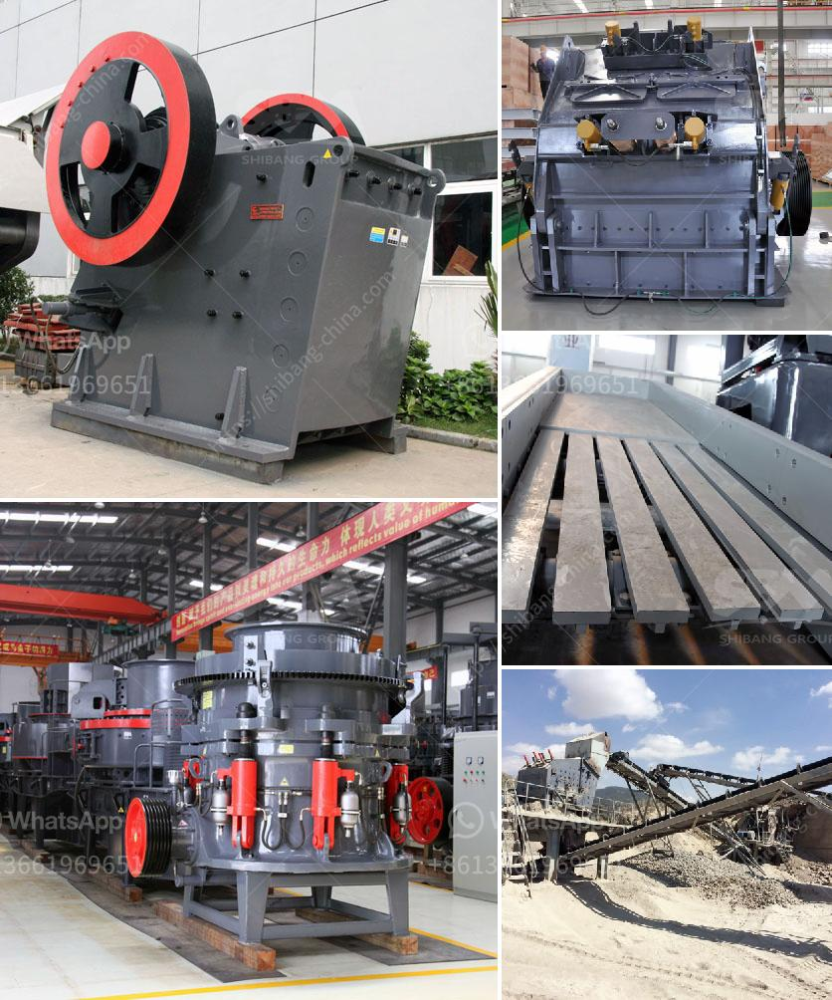

<h3>200 500 tph bauxite mining and processing plant</h3>
Bauxite is an important mineral ore that is widely used in aluminum manufacturing, refractory, and chemical industries. As such, bauxite mining and processing facilities are crucial to the development of the aluminum industry, which has become a key driver of economic growth in many countries.

To cater to the growing demand for bauxite, companies are establishing mining and processing plants that can efficiently produce the required quantities without compromising on quality. A 200-500 TPH bauxite mining and processing plant is an ideal choice for medium scale aluminum industry projects. With precision equipment, high standard construction, and advanced management practices, a well-designed plant will deliver optimal production outcomes while minimizing operational costs.

One of the key advantages of this type of bauxite mining plant is its capability to process a wide range of bauxite ores. Bauxite, which is classified into different grades based on its alumina content, requires a specialized processing approach. A 200-500 TPH plant can handle both high-grade bauxite ores with more than 50% alumina content and lower-grade ores with around 40-50% alumina content. This flexibility allows the plant to adapt to changes in the raw material availability and optimize the output accordingly.

The efficient utilization of energy and resources is another crucial aspect of a well-designed bauxite mining and processing plant. High-performance equipment and state-of-the-art technology enable the plant to achieve a high level of energy efficiency, reducing both operating costs and the environmental impact. The plant should be equipped with energy-efficient crushers, mills, and conveyors to minimize energy consumption. Additionally, incorporating smart automation and control systems helps optimize the use of resources, such as water and electricity, while ensuring smooth operations.

A properly designed 200-500 TPH plant will encompass all the necessary processing stages, including crushing, grinding, de-silication, and finally, the extraction of alumina from bauxite. The plant should be designed to handle a high volume of bauxite ore while providing consistent quality and purity in the final alumina product. It should also adhere to strict environmental regulations and promote sustainability by implementing proper waste management strategies, such as recycling and reusing water and by-products.

Furthermore, establishing a bauxite mining and processing plant contributes to the local economy by creating job opportunities and supporting downstream industries. The plant would require a skilled workforce and require substantial investments in infrastructure and technology, creating employment opportunities for both skilled and unskilled workers. Moreover, the availability of locally sourced alumina is beneficial to the aluminum manufacturing sector, reducing reliance on imports and boosting the domestic economy.

In conclusion, a 200-500 TPH bauxite mining and processing plant plays a vital role in meeting the growing demand for high-quality alumina. Such a facility helps optimize the utilization of bauxite ores, reduce environmental impact, and contribute to local economic development. With proper design, advanced technology, and efficient resource management, the plant offers a sustainable solution to support the aluminum industry's growth and ensure a stable supply of raw materials.
<h3>Contact us</h3><ul><li><strong>Whatsapp:&nbsp;<a href="https://wa.me/8613661969651">+8613661969651</a></strong></li><li><a href="https://swt.shibang-china.com/?git&amp;zhl&amp;200 500 tph bauxite mining and processing plant"><strong>Online Service(chat now)</strong></a></li></ul><h3>Related</h3><ul><li><a href='gypsum powder manufacturing plant price.md'>gypsum powder manufacturing plant price</a></li><li><a href='300tpd mini cement plant task cost in india.md'>300tpd mini cement plant task cost in india</a></li><li><a href='used mobile jaw crusher dealers in ghana.md'>used mobile jaw crusher dealers in ghana</a></li><li><a href='stone crusher user manual.md'>stone crusher user manual</a></li><li><a href='stone crusher price ton per day.md'>stone crusher price ton per day</a></li></ul>