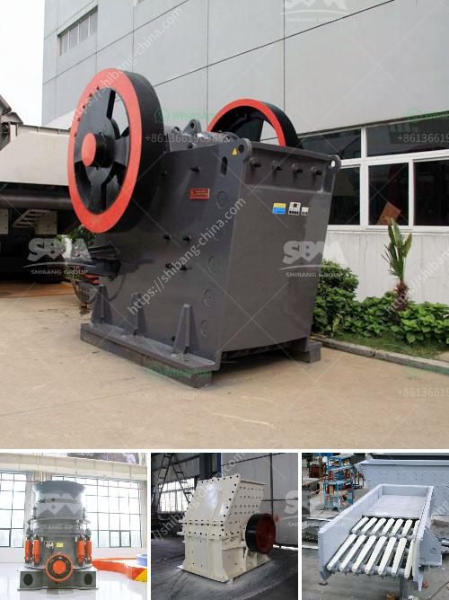

<h3>200 tph mobile crusher prices used</h3>
200 tph mobile crusher prices used. 200 TPH mobile crusher price used is one of the main specifications of this machine, it is used for handling raw materials in various industries.

The commonly used jaw crusher is used to crush stones with hardness of less than 350 MPa, such as limestone, granite, basalt, quartz, etc. The mobile crusher is suitable for secondary and tertiary crushing, material selection from high to low. The highest compressive strength of the crushed material is 320MPa.

The 200 TPH mobile crusher price used has the advantage of reasonable matching, unobstructed discharge all line, reliable working, convenient operation, high efficiency and saving energy. Especially the mobility is very good, so the 200 TPH mobile crusher price used can greatly reduce the material transportation cost and save money for the customers.

The installation of this crushing plant is quick and easy, which makes it efficient and convenient. And this mobile crusher price used is equipped with advanced overload protection, which eliminates the possibility of equipment damage due to internal blockage or steel bar fragmentation.

In addition, the 200 TPH mobile crusher price used not only improves the production capacity and crushing efficiency, but also expands the application scope. From limestone to basalt, from stone production to all kinds of ores and crushing, these machines can complete the fine crushing, medium crushing and ultra-fine crushing. It is a new generation of energy-saving and high-efficiency crusher, which is widely used in mineral processing, building materials, silicate and chemical industries.

200 TPH mobile crusher price used has advanced design, excellent performance, high production efficiency, convenient operation and maintenance, economic operation cost, stable and reliable work. Compared with the traditional fixed crusher, there is a great improvement in the adjustment range of discharge port. It can meet the requirements of different users for materials to meet the requirements of different production processes and can be equipped with cone crusher or dust removal equipment.

In conclusion, the 200 TPH mobile crusher price used in the market is generally higher than that of static crusher, because of the advanced technology, higher production efficiency and more environmental protection. Its price will be higher, so the investment budget varies a lot. However, for users who have limited funds, do not have enough space or do not want to constantly buy new machines, the 200 TPH mobile crusher price used is a better choice. This machine has good performance and is worth buying.
<h3>Contact us</h3><ul><li><strong>Whatsapp:&nbsp;<a href="https://wa.me/8613661969651">+8613661969651</a></strong></li><li><a href="https://swt.shibang-china.com/?git&amp;zhl&amp;200 tph mobile crusher prices used"><strong>Online Service(chat now)</strong></a></li></ul><h3>Related</h3><ul><li><a href='difference between vsi and hsi.md'>difference between vsi and hsi</a></li><li><a href='coal crusher and screen plant for sale.md'>coal crusher and screen plant for sale</a></li><li><a href='mobile crusher in sweden.md'>mobile crusher in sweden</a></li><li><a href='mobile crushing plant philippines.md'>mobile crushing plant philippines</a></li><li><a href='jaw crushers supplier.md'>jaw crushers supplier</a></li></ul>