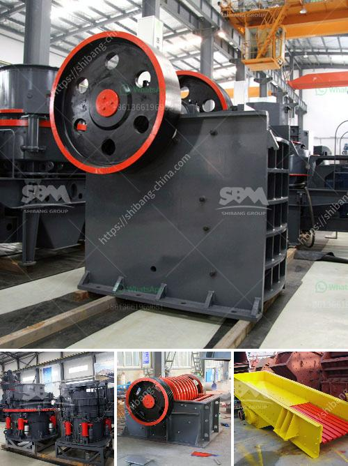

<h3>200 tph stone crusher price</h3>
200 tph stone crusher, also known as mobile crushing plant, is one of the most commonly used crushing equipment for mining and construction. It is widely used in mine, metallurgy, building materials, highway, railway, water conservation and chemical industry. The most important feature of this equipment is its flexibility and high productivity, which guarantees maximum profit for users.

The initial cost of the 200 tph stone crusher is about Rs. 1 lakh to 3 lakh. It is mainly used for crushing various ores and bulk materials with compression strength not exceeding 320Mpa into medium-sized grains. The machine can be equipped with different types of crushers according to the actual production requirements of users.

In addition to the primary crusher, secondary and tertiary crushers can also be selected to achieve the required particle size. The price of the 200 tph stone crusher is also affected by factors such as market demand, equipment quality, manufacturer competition and policy regulation. With the continuous improvement of crushing technology, the performance of the equipment is constantly improving and the price is getting higher and higher.

For example, during the pandemic, most stone crusher manufacturers have increased their product prices to offset the impact of rising raw material costs. However, comparing with other similar equipment, the 200 tph stone crusher has relatively lower price. The raw materials used in the production are reasonable and the technology and craftsmanship are advanced, which can effectively reduce the production cost and improve the overall value of the equipment.

Overall, the 200 tph stone crusher is a practical and versatile crushing equipment. It can not only be used for various materials, but also has the advantages of convenient installation, reliable operation and high productivity. The price is affordable and reasonable, making it a cost-effective choice for many users.
<h3>Contact us</h3><ul><li><strong>Whatsapp:&nbsp;<a href="https://wa.me/8613661969651">+8613661969651</a></strong></li><li><a href="https://swt.shibang-china.com/?git&amp;zhl&amp;200 tph stone crusher price"><strong>Online Service(chat now)</strong></a></li></ul><h3>Related</h3><ul><li><a href='zinc ore suppliers in south africa.md'>zinc ore suppliers in south africa</a></li><li><a href='diamond making machines germany.md'>diamond making machines germany</a></li><li><a href='puzzolana crusher malaysia.md'>puzzolana crusher malaysia</a></li><li><a href='granite cone crusher.md'>granite cone crusher</a></li><li><a href='roller mill for dolmite.md'>roller mill for dolmite</a></li></ul>