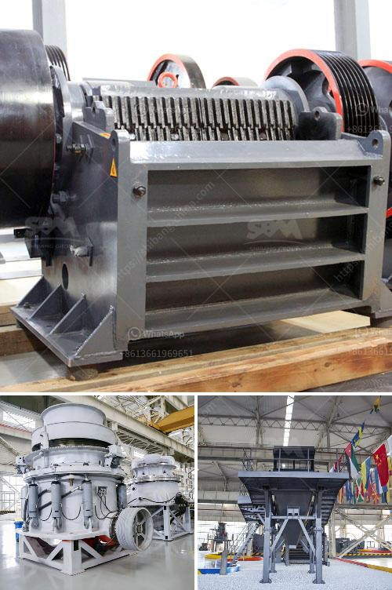

<h3>200mm crusher sieve opening sizes</h3>
In the construction industry, the use of high-quality aggregates is crucial for producing strong and durable structures. Aggregates are generally obtained from natural sources such as rivers, quarries, or recycled materials like demolished concrete. However, these raw materials need to undergo proper processing to meet the desired specifications for construction purposes. One essential step in this process is crushing, which reduces the size of the aggregates to meet the required grading limits. This is where 200mm crusher sieve opening sizes come into play.

The crusher sieve is a screening device that separates the crushed materials into different size fractions. It consists of a mesh with specific opening sizes, allowing only particles of a certain size to pass through while retaining larger particles. In the case of 200mm crusher sieve opening sizes, it means that the mesh has square openings with side lengths of 200mm. 

The choice of crusher sieve opening sizes is vital for efficient aggregate production. It impacts the final quality and gradation of the aggregates, which, in turn, affects the performance of the concrete or asphalt mix. Let's dive into some key reasons why the 200mm sieve opening size is significant in this context.

Firstly, using a 200mm crusher sieve opening size ensures that the final aggregates are of suitable size for various construction applications. If the sieve opening size is too small, it may cause the production of excessive fines. These fine particles can lead to the clogging of the mix, resulting in a higher water demand and potentially compromising the strength of the hardened concrete. On the other hand, if the sieve opening size is too large, there is a risk of coarse aggregates being included in the mix, which can negatively affect the workability and finishability of the concrete.

Secondly, the 200mm crusher sieve opening size allows for efficient screening. It strikes a balance between capturing the desired size fraction and allowing smaller particles to pass through. Efficient screening is crucial to make the most of the raw materials and maximize the production capacity of the crusher. By ensuring that the crusher is only processing aggregates within the specified size range, it reduces unnecessary wear and tear on the equipment, resulting in lower maintenance costs and increased operational efficiency.

Furthermore, the 200mm sieve opening size promotes consistency in the gradation of the produced aggregates. Consistency in gradation is essential for achieving consistent concrete or asphalt mix designs. A well-graded aggregate blend with particles of various sizes optimizes the packing density, reducing the voids between particles. This, in turn, enhances the overall mechanical properties and durability of the hardened concrete. With a 200mm sieve opening size, it becomes easier to control the particle distribution within the desired range, ensuring consistent and uniform quality of the final product.

In conclusion, the choice of 200mm crusher sieve opening sizes is crucial for efficient aggregate production. It not only ensures that the final aggregates meet the required size specifications but also promotes efficient screening and consistent gradation. Implementing the right sieve opening size contributes to the production of high-quality aggregates, ultimately leading to the construction of durable and robust structures.
<h3>Contact us</h3><ul><li><strong>Whatsapp:&nbsp;<a href="https://wa.me/8613661969651">+8613661969651</a></strong></li><li><a href="https://swt.shibang-china.com/?git&amp;zhl&amp;200mm crusher sieve opening sizes"><strong>Online Service(chat now)</strong></a></li></ul><h3>Related</h3><ul><li><a href='hammer crusher kapasitas 10 ton per jam dan ukurannya.md'>hammer crusher kapasitas 10 ton per jam dan ukurannya</a></li><li><a href='impact stone crusher.md'>impact stone crusher</a></li><li><a href='stone crusher machine in pakistan.md'>stone crusher machine in pakistan</a></li><li><a href='river pebble crusher manufacturer.md'>river pebble crusher manufacturer</a></li><li><a href='alluvial gold washing plants in south africa.md'>alluvial gold washing plants in south africa</a></li></ul>