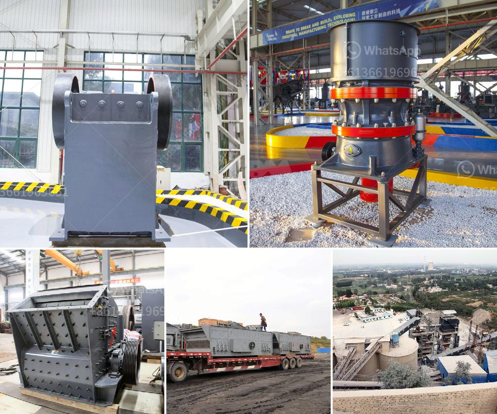

<h3>200tph mobile crusher plant for rent in jharkhand</h3>
The mobile crusher plant for rent in Jharkhand is widely used in the mining industry, stone processing, road and bridge construction, and other industries and sectors. Portable crusher plants allow you to get your mobile crusher into production quickly and easily. These plants are easy to set up and are highly portable, making them perfect for mineral extraction and processing applications.

The mobile crushing plant is designed with a vibrating feeder, a jaw crusher, a cone crusher, a vibrating screen, and belt conveyors. The crushing plant can be customized according to different requirements. The versatile crusher plant can work autonomously, or combine with other machines to form a complete production line.

One of the key benefits of a mobile crusher plant is its flexibility. With a mobile crusher, you can customize the crushing process according to the material types and your specific needs. It ensures efficient and reliable operation under any circumstances.

Jharkhand is a mineral-rich state in eastern India. The abundance of minerals like limestone, coal, iron ore, copper ore, manganese ore, bauxite, and granite makes Jharkhand an attractive destination for mining and mineral extraction activities. The mobile crusher plant for rent in Jharkhand is the best-hired solution for mining enterprises.

The mobile crusher plant for rent is the most common crushing equipment in the mining industry. The plants have a compact design and a small footprint. They are ideal for small to medium-sized mines. A crusher plant for rent has a flexible design for various applications. It can meet any production requirements.

Moreover, the plant is available for lease at a competitive rate. The mobile crusher plant for rent in Jharkhand rental fees are inclusive of all maintenance costs, ensuring hassle-free operation of the plant.

For a wide range of crushing applications, the portable crusher plant for rent is the best choice for contractors, quarry operators, and others. With the expanding demand for mobile stone crushers in India, the demand for mobile crushing plants is increasing at a swift pace.

Mobile crusher for rent offers a range of innovative solutions for all requirements in the mineral processing and mining industry. The plant has a small footprint and it can be transported easily. It is the perfect choice for contractors looking for a reliable and affordable solution for their crushing needs.

In conclusion, the mobile crusher plant for rent in Jharkhand offers great convenience and flexibility to investors and quarry operators. The rental services of mobile crushing plants are not limited to Jharkhand only; they are available across all states of India. The plants have a production capacity ranging from 10 to 200 TPH. With advanced technology and excellent performance, the mobile crusher plant is an ideal choice for contractors, quarry operators, and mining companies.
<h3>Contact us</h3><ul><li><strong>Whatsapp:&nbsp;<a href="https://wa.me/8613661969651">+8613661969651</a></strong></li><li><a href="https://swt.shibang-china.com/?git&amp;zhl&amp;200tph mobile crusher plant for rent in jharkhand"><strong>Online Service(chat now)</strong></a></li></ul><h3>Related</h3><ul><li><a href='long distance conveyor of lafarge cement in bangladesh.md'>long distance conveyor of lafarge cement in bangladesh</a></li><li><a href='used portable rock crusher for sale.md'>used portable rock crusher for sale</a></li><li><a href='stamler usa feeder breaker crusher.md'>stamler usa feeder breaker crusher</a></li><li><a href='japan jaw crusher machine.md'>japan jaw crusher machine</a></li><li><a href='prices of granite crusher.md'>prices of granite crusher</a></li></ul>