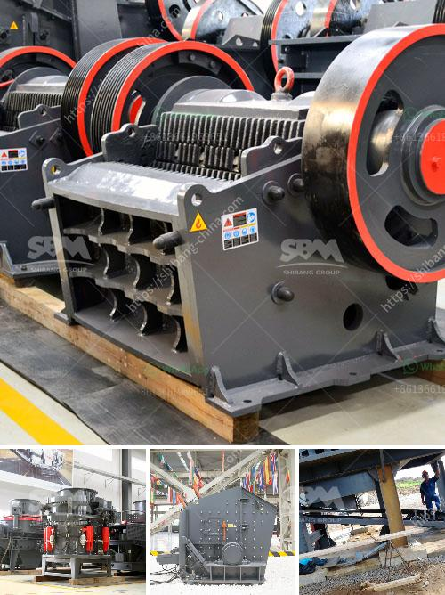

<h3>25 tph vsi crushers</h3>
The VSI Crusher (Vertical Shaft Impactor) is a type of impact crusher that offers higher reduction ratios at lower energy consumption. You can consider them as a stone pump that operates like a centrifugal pump. There are plenty of VSIs are available in the market such as sandvik's CV series and Barmac B series. These crushing machines use the rock-on-rock crushing principle to produce cubicle-shaped, high-quality aggregates used in the construction industry.

One of the leading players in the VSI vertical shaft impact crusher market is Sandvik Mining and Rock Technology. The company offers a range of products suited for small-scale to large-scale operations. Sandvik's CV series VSI crushers are designed for high-quality production and minimal downtime. These crushers have a durable, rugged construction and a dedicated motor, ensuring both longevity and efficiency.

When it comes to small-scale mining operations, these 25 TPH VSI crushers are perfect. They are capable of crushing all types of rocks and ores effortlessly. Their versatility and efficiency make them an excellent choice for contractors who need to complete multiple projects within a tight timeframe.

1. Increased Production and Reduced Downtime: With a 25 TPH capacity, these VSI crushers are engineered to deliver high-quality aggregates consistently. Their robust design ensures minimal downtime for maintenance, allowing operators to maximize production output.

2. Versatility in Crushing Materials: The 25 TPH VSI crushers can handle various types of materials, including hard rocks, ores, and even recycled concrete. This versatility makes them suitable for a wide range of applications, from road construction to producing artificial sand.

3. Adjustable Gradation Control: Sandvik's 25 TPH VSI crushers provide excellent control over the particle shape and size, allowing contractors to produce aggregates with the desired gradation. This feature is crucial for meeting specific project requirements and achieving optimal concrete or asphalt mix designs.

4. Energy Efficiency: These crushers are designed to minimize energy consumption while maximizing production output. The dedicated motor ensures smooth operation and reduces power wastage, resulting in cost savings for the operator.

5. Compact and Mobile: Sandvik's 25 TPH VSI crushers are compact and can be easily transported from one site to another. Their mobility allows contractors to complete projects in various locations, eliminating the need for multiple crushers.

In summary, 25 TPH VSI crushers are powerful crushing machines suitable for small-scale mining operations. They offer increased production, reduced downtime, and excellent control over particle shape and size. Their versatility and energy efficiency make them essential tools for contractors looking to produce high-quality aggregates for construction projects. With Sandvik's CV series VSI crushers, small-scale mining operators can achieve consistent, high-quality production while optimizing costs and maximizing their return on investment.
<h3>Contact us</h3><ul><li><strong>Whatsapp:&nbsp;<a href="https://wa.me/8613661969651">+8613661969651</a></strong></li><li><a href="https://swt.shibang-china.com/?git&amp;zhl&amp;25 tph vsi crushers"><strong>Online Service(chat now)</strong></a></li></ul><h3>Related</h3><ul><li><a href='mobile stone crusher gauteng.md'>mobile stone crusher gauteng</a></li><li><a href='vertical grinding machine defination.md'>vertical grinding machine defination</a></li><li><a href='aggregate crusher supplier tanzania.md'>aggregate crusher supplier tanzania</a></li><li><a href='the world largest mobile crusher.md'>the world largest mobile crusher</a></li><li><a href='ball mill quartz lining suppliers.md'>ball mill quartz lining suppliers</a></li></ul>