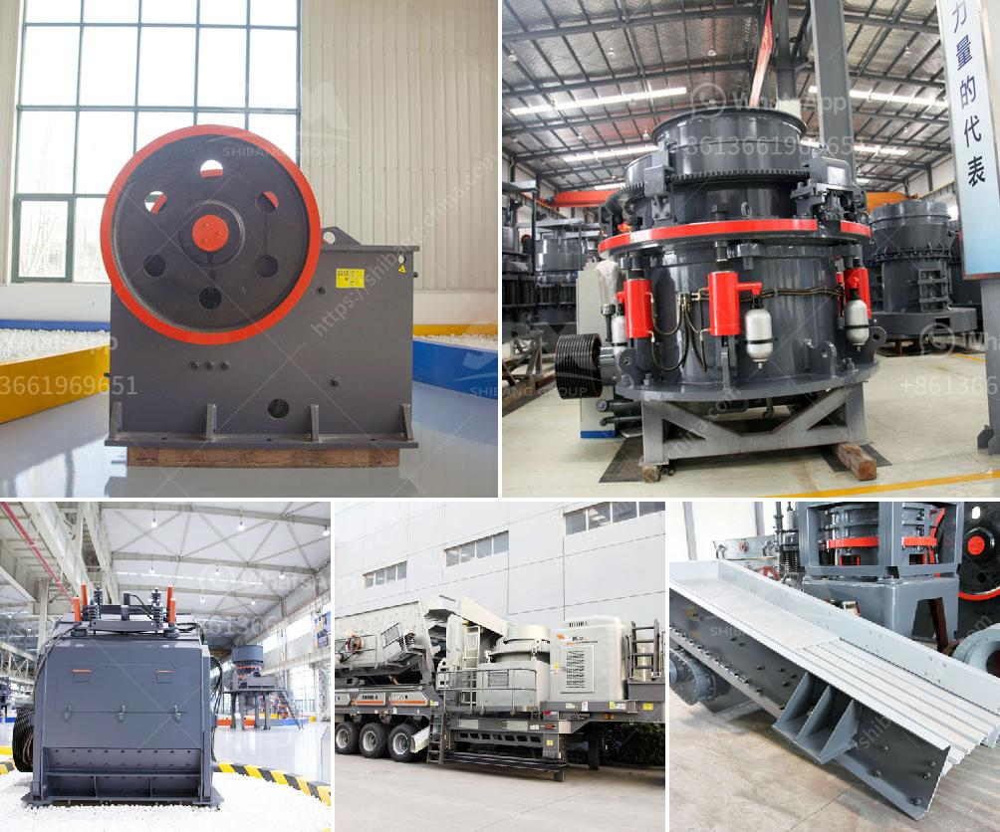

<h3>2nd hand mobile crusher in dubai</h3>
The market for second-hand mobile crushers in Dubai has been growing rapidly in recent years. With the increasing pace of urbanization, more and more construction projects are being carried out in Dubai, which has increased the demand for building materials and construction equipment. The high-quality second-hand mobile crushers in Dubai have helped the construction companies and contractors to save money and improve their operational efficiency.

The second-hand mobile crushers in Dubai not only provide good mobility but also save a lot of money for the construction projects. The mobile crusher machine saves the time to enter the working place. It is unnecessary to build the foundation for fixed crusher machines, which are expensive and take a lot of time. By using mobile crushers, companies can save transportation and maintenance costs, reduce labor costs, and move more conveniently.

The second-hand mobile crusher machines have been widely used in many industries, such as mining, chemical, metallurgy, building materials, highways, railways, water conservancy, and chemical industries, among all these industries, the most important application field is the construction field, while the second-hand mobile crusher machines are used for construction materials processing.

The second-hand mobile crusher machines have good overall performance and can directly satisfy the construction waste recycling and processing requirements. The mobile jaw crusher machine is equipped with a convenient and efficient feeding system, streamlined design, movable jaw plate, convenient adjusting device, and integrated motor, etc.

The second-hand mobile crusher machines are suitable for medium hardness and brittle materials, such as limestone, coal and other materials. The crushing materials are mainly in the center of the rotor and are successfully thrown to the surrounding rotor. The shaft is driven by a motor and a belt pulley to make the rotor rotate at high speed. When the material enters the chamber, it hits and breaks with the hammer on the rotor, and then directly falls from the lower discharge to the conveyor belt or other processing equipment.

In conclusion, the second-hand mobile crushers in Dubai are the perfect choice for the construction industry, benefiting both contractors and individual customers alike. The wide range of crushers available in the market allows buyers to select the most suitable model as per their specific requirements. With their cost-effectiveness, mobility, and convenience, second-hand mobile crushers are creating a revolution in the construction industry in Dubai.
<h3>Contact us</h3><ul><li><strong>Whatsapp:&nbsp;<a href="https://wa.me/8613661969651">+8613661969651</a></strong></li><li><a href="https://swt.shibang-china.com/?git&amp;zhl&amp;2nd hand mobile crusher in dubai"><strong>Online Service(chat now)</strong></a></li></ul><h3>Related</h3><ul><li><a href='gemstones found in nigeria.md'>gemstones found in nigeria</a></li><li><a href='work method statement for jaw crusher.md'>work method statement for jaw crusher</a></li><li><a href='slag grinding mill india.md'>slag grinding mill india</a></li><li><a href='diamond making machines germany.md'>diamond making machines germany</a></li><li><a href='impact crusher zenith.md'>impact crusher zenith</a></li></ul>