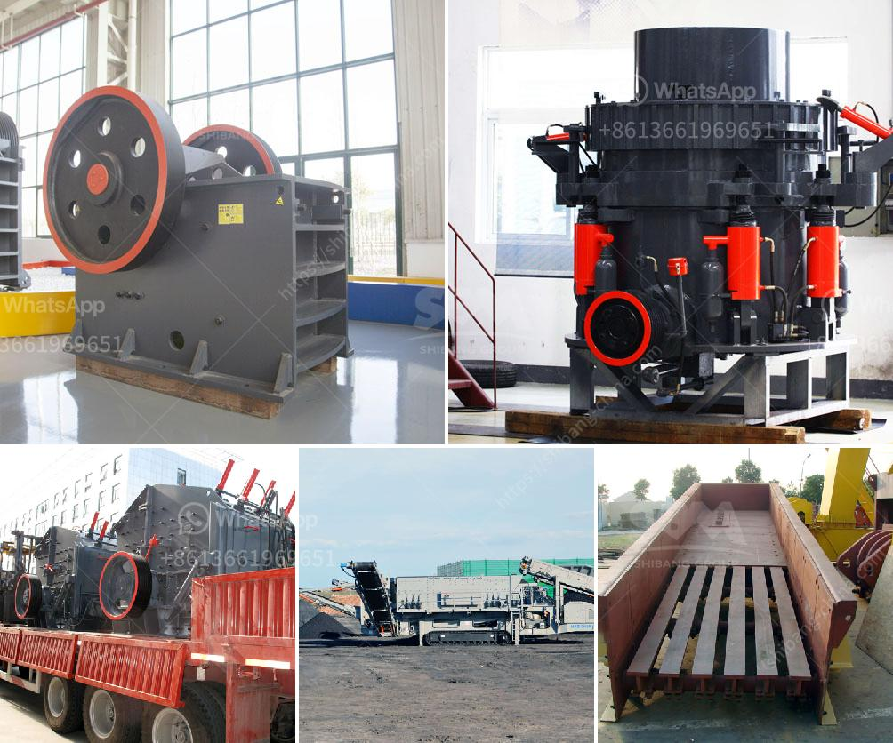

<h3>3 4 inch crushed limestone</h3>
Limestone is a sedimentary rock commonly used for landscaping purposes. Its natural beauty and durability make it an ideal material for various outdoor projects. Crushed limestone, in particular, is popular among homeowners and contractors alike due to its versatility and affordability. In this article, we will explore the many uses and advantages of 3/4 inch crushed limestone.

One of the primary uses of 3/4 inch crushed limestone is as a base material for construction projects. Whether you are constructing a patio, driveway, or walkway, a solid foundation is essential. Crushed limestone provides a stable surface that helps prevent shifting or settling over time, ensuring the longevity and integrity of your project. Its compact nature also allows for excellent drainage, preventing water buildup and potential damage.

In addition to its functional benefits, 3/4 inch crushed limestone is a visually appealing material that can enhance the overall aesthetic of your outdoor space. Its warm, earthy tones create a natural and inviting atmosphere. Whether you prefer a rustic or contemporary look, crushed limestone blends seamlessly with various design styles, making it a versatile choice.

Beyond its practical use as a construction base, 3/4 inch crushed limestone has several other applications in landscaping. It can be used to create decorative borders, define pathways, or even as a ground cover for flower beds and garden areas. The crushed limestone acts as a natural weed deterrent, minimizing the need for herbicides and ensuring a low-maintenance landscape.

Furthermore, crushed limestone is an environmentally friendly choice. Unlike other materials such as concrete or asphalt, limestone is a natural, renewable resource. Its extraction and production have a minimal impact on the environment, making it an eco-conscious option for your outdoor projects. Additionally, crushed limestone can be recycled, reducing waste and minimizing environmental footprint.

When purchasing 3/4 inch crushed limestone, it is crucial to consider the quality and source of the material. Ensure that the limestone is from a reputable supplier that adheres to proper extraction and production practices. A high-quality product will ensure better performance and longevity.

When using crushed limestone, it is essential to properly prepare the area before installation. Clear the site of any vegetation or debris and ensure a level and compacted surface. Spread the crushed limestone evenly, using a rake or shovel, and compact it using a vibrating compactor or a hand tamper. This ensures proper stability and longevity of your project.

Overall, 3/4 inch crushed limestone is a versatile and popular choice for various landscaping and construction projects. Its durability, affordability, and visual appeal make it an excellent option for homeowners and contractors alike. With its ability to provide a sturdy base, enhance aesthetics, and contribute to environmental sustainability, crushed limestone is an investment worth considering for your outdoor endeavors.
<h3>Contact us</h3><ul><li><strong>Whatsapp:&nbsp;<a href="https://wa.me/8613661969651">+8613661969651</a></strong></li><li><a href="https://swt.shibang-china.com/?git&amp;zhl&amp;3 4 inch crushed limestone"><strong>Online Service(chat now)</strong></a></li></ul><h3>Related</h3><ul><li><a href='process of making methanol from coal.md'>process of making methanol from coal</a></li><li><a href='price of hammer mill in china.md'>price of hammer mill in china</a></li><li><a href='crusher in hialeah sale.md'>crusher in hialeah sale</a></li><li><a href='jaw crusher supply.md'>jaw crusher supply</a></li><li><a href='impact crusher zenith.md'>impact crusher zenith</a></li></ul>