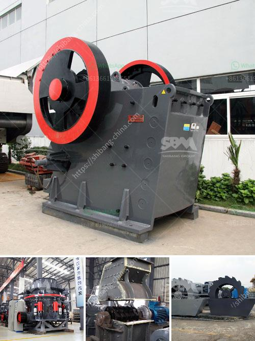

<h3>3 meters conveyor belts</h3>
Conveyor belts are an integral part of various industries, enabling the smooth and efficient movement of materials within a production or logistics facility. One popular type of conveyor belt is the 3-meter model, which offers a reliable and versatile solution for businesses.

Measuring three meters in length, these conveyor belts are suitable for medium-sized operations that require the transportation of goods within a certain space. The use of conveyor belts streamlines processes by eliminating the need for manual handling, reducing labor costs, and improving overall productivity.

One key advantage of 3-meter conveyor belts is their flexibility in accommodating different materials. They can handle a wide range of products, including small items, bulk materials, and even heavy loads. This versatility makes them ideal for numerous industries, such as manufacturing, warehousing, mining, and agriculture.

Furthermore, these conveyor belts are designed to withstand the rigorous demands of industrial environments. They are constructed with durable materials like rubber, nylon, or polyester, ensuring longevity and reliability. The belts are capable of withstanding high temperatures, heavy weights, and abrasive materials.

In addition to their robust construction, 3-meter conveyor belts are equipped with various features to enhance their functionality. They can be customized with different belt textures, such as smooth or rough surfaces, to optimize grip and prevent slipping. Moreover, additional accessories like side guides, cleats, and power-transfer modules can be integrated to accommodate specific requirements.

With their compact size, 3-meter conveyor belts can efficiently fit into existing production layouts or facilities with space constraints. They can be easily installed and integrated into a variety of systems, such as assembly lines or packaging processes.

In conclusion, 3-meter conveyor belts offer a reliable and adaptable solution for businesses in need of efficient material transportation. Their versatility, durability, and customizable features make them suitable for various industries. By implementing these conveyor belts, companies can enhance productivity, reduce labor costs, and streamline their operations.
<h3>Contact us</h3><ul><li><strong>Whatsapp:&nbsp;<a href="https://wa.me/8613661969651">+8613661969651</a></strong></li><li><a href="https://swt.shibang-china.com/?git&amp;zhl&amp;3 meters conveyor belts"><strong>Online Service(chat now)</strong></a></li></ul><h3>Related</h3><ul><li><a href='vertical impact crusher quote.md'>vertical impact crusher quote</a></li><li><a href='calcite powder making machine in india.md'>calcite powder making machine in india</a></li><li><a href='crusher stone for sale.md'>crusher stone for sale</a></li><li><a href='slag crusher cost.md'>slag crusher cost</a></li><li><a href='gypsum gypsum plant supplier from germany.md'>gypsum gypsum plant supplier from germany</a></li></ul>