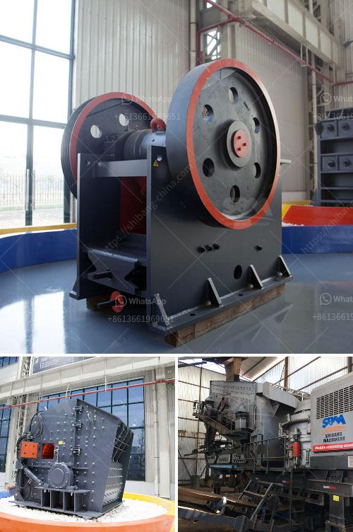

<h3>3 roll mill specifications</h3>
A three-roll mill is a type of grinding mill that is commonly used in the production of various types of paints, coatings, and other materials. It consists of three horizontally positioned rollers that rotate in opposite directions and at different speeds. The material to be processed is fed between the rollers and is gradually milled into a uniform paste or powder.

One of the key advantages of a three-roll mill is its ability to process a wide range of materials. It can effectively grind and disperse materials such as pigments, fillers, additives, and even high-viscosity pastes. This makes it a versatile tool for various industries, including the manufacturing of cosmetics, inks, ceramics, and pharmaceuticals.

When choosing a three-roll mill, it is essential to consider its specifications to ensure it meets your processing needs. Here are some key specifications to look for:

1. Roller Diameter and Length: The size of the rollers determines the capacity and throughput of the mill. It also affects the fineness of the final product. Typical roller diameters range from 80 to 200 mm, with lengths varying from 150 to 450 mm. Larger diameters and lengths increase the processing capacity but may require more powerful motors.

2. Roller Material: The material used for the rollers should be carefully selected based on the application. Common roller materials include stainless steel, ceramics, and tungsten carbide. Stainless steel is suitable for general-purpose applications, while ceramics and tungsten carbide are more resistant to wear and corrosion, making them ideal for processing abrasive or chemically aggressive materials.

3. Roller Gap: The gap between the rollers determines the final particle size and the degree of dispersion. It is adjustable and usually ranges from 5 to 30 micrometers. Smaller gaps result in finer particles, while larger gaps allow for a coarser texture. Some models feature automatic control systems that precisely maintain the desired gap distance throughout the milling process.

4. Speed Control: Three-roll mills typically have individual drive motors for each roller, allowing for independent speed control. This feature enables precise adjustment of the rotational speeds to optimize the grinding process. It also ensures consistent results and minimizes the risk of overheating or overworking the material.

5. Cooling and Heating Options: Some three-roll mills come equipped with cooling or heating systems to regulate the temperature during milling. Cooling systems, such as water jackets, prevent unwanted temperature rise that can affect the material's properties and increase the risks of agglomeration. Heating options, on the other hand, can be used to facilitate certain processes that require elevated temperatures.

In conclusion, when selecting a three-roll mill, understanding its specifications is crucial for achieving desired processing results. Roller size, material, gap, speed control, and additional features must be considered based on the desired particle size, dispersion level, and the characteristics of the materials being processed. By choosing the right specifications, manufacturers can maximize efficiency, quality, and profitability in their production processes.
<h3>Contact us</h3><ul><li><strong>Whatsapp:&nbsp;<a href="https://wa.me/8613661969651">+8613661969651</a></strong></li><li><a href="https://swt.shibang-china.com/?git&amp;zhl&amp;3 roll mill specifications"><strong>Online Service(chat now)</strong></a></li></ul><h3>Related</h3><ul><li><a href='rock crushing machines for sale.md'>rock crushing machines for sale</a></li><li><a href='vertical shaft crusher.md'>vertical shaft crusher</a></li><li><a href='zimbabwe hammer mills.md'>zimbabwe hammer mills</a></li><li><a href='mantencion a cone crusher.md'>mantencion a cone crusher</a></li><li><a href='basalt crusher price in senegal.md'>basalt crusher price in senegal</a></li></ul>