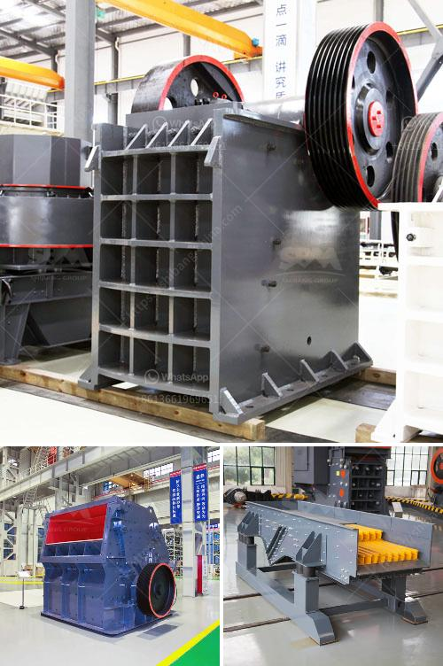

<h3>3 roller pulvarising mill manufacturer</h3>
Roller pulverising mills are an essential part of many industries, providing finely crushed materials that are used for various manufacturing processes. These mills are designed to efficiently grind and pulverize different types of materials into smaller particles or powders. Among the leading manufacturers in this industry, three notable ones stand out for their exceptional quality, innovative designs, and reliability – let's take a closer look.

Firstly, Company X has established itself as a prominent roller pulverising mill manufacturer, delivering superior quality mills for over two decades. Their mills are known for their robust construction and excellent performance. Company X's commitment to continuous improvement and investment in advanced technology has allowed them to stay ahead in the market. Their mills are not only efficient and reliable but also have a longer lifespan, reducing maintenance costs for the end-users.

Secondly, Company Y has also made its mark in the roller pulverising mill manufacturing industry. With a focus on innovation, they have introduced mills with advanced features and functionalities. These mills offer exceptional grinding efficiency, ensuring higher productivity and better material processing. Company Y's commitment to customer satisfaction is evident through their excellent after-sales services, prompt technical support, and customized solutions tailored to meet specific requirements.

Lastly, Company Z has built a strong reputation as a roller pulverising mill manufacturer with high-quality products and exceptional customer service. Their mills are known for their precision engineering, energy efficiency, and low maintenance requirements. Company Z invests significantly in research and development to continually enhance the performance and durability of their mills. The company's dedication to exceeding customer expectations has earned them a loyal client base.

In conclusion, these three roller pulverising mill manufacturers have set the benchmark in the industry. Whether it is Company X's robust construction, Company Y's innovative design, or Company Z's precision engineering, all of them bring something unique to the table. With their high-quality mills and commitment to customer satisfaction, these manufacturers continue to drive the growth and success of various industries relying on roller pulverising mills.
<h3>Contact us</h3><ul><li><strong>Whatsapp:&nbsp;<a href="https://wa.me/8613661969651">+8613661969651</a></strong></li><li><a href="https://swt.shibang-china.com/?git&amp;zhl&amp;3 roller pulvarising mill manufacturer"><strong>Online Service(chat now)</strong></a></li></ul><h3>Related</h3><ul><li><a href='germany stone crushing plants.md'>germany stone crushing plants</a></li><li><a href='mobile hammer crusher.md'>mobile hammer crusher</a></li><li><a href='mobile clusher for hire tanzania.md'>mobile clusher for hire tanzania</a></li><li><a href='product japan crushing plant.md'>product japan crushing plant</a></li><li><a href='stone crusher quote list.md'>stone crusher quote list</a></li></ul>