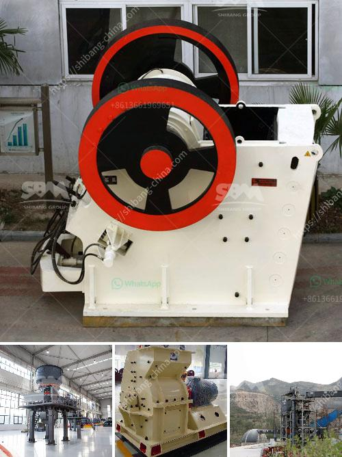

<h3>300tpd mini cement plant task cost in india</h3>
The cement industry is one of the prominent industries in India. They play a pivotal role in building the infrastructure of the country. With the increasing demand for cement, many small and medium-sized enterprises (SMEs) have ventured into the cement manufacturing business. One such venture is the 300tpd mini cement plant.

The task cost of setting up a 300tpd mini cement plant in India has been estimated to be around INR 3,500 crores (USD 500 million). The cost includes the procurement and installation of machinery and equipment, as well as land acquisition and other infrastructure development. 

To set up a mini cement plant, a feasibility study is conducted to assess the profitability and sustainability of the project. The study takes into account factors like availability of raw materials, market demand, and competition. Once the feasibility study is complete, the project moves forward.

The first step in setting up a mini cement plant is land acquisition. Sufficient land has to be procured to set up the plant and accommodate various facilities such as the manufacturing unit, storage area, and administrative building.

The next step is procuring machinery and equipment required for the manufacturing process. This includes crushers, mills, conveyors, and kilns. The cost of machinery and equipment can vary depending on the quality and capacity.

Once the machinery is procured, the plant layout and construction work begin. The plant layout is designed to optimize the workflow and ensure efficient production. Construction work involves building structures like the manufacturing unit, storage areas, and administrative building. Infrastructure development, such as water supply and power connection, also needs to be included in the task cost.

Overall, setting up a 300tpd mini cement plant requires significant investment, meticulous planning, and coordination. However, with the growing demand for cement in India, such ventures have the potential to be profitable in the long run. They not only contribute to the development of the country but also generate employment opportunities in the local area.
<h3>Contact us</h3><ul><li><strong>Whatsapp:&nbsp;<a href="https://wa.me/8613661969651">+8613661969651</a></strong></li><li><a href="https://swt.shibang-china.com/?git&amp;zhl&amp;300tpd mini cement plant task cost in india"><strong>Online Service(chat now)</strong></a></li></ul><h3>Related</h3><ul><li><a href='mills road crusher machine.md'>mills road crusher machine</a></li><li><a href='small grinding machine for limestone.md'>small grinding machine for limestone</a></li><li><a href='copper leaching plants for sale.md'>copper leaching plants for sale</a></li><li><a href='cobalt mobile crusher.md'>cobalt mobile crusher</a></li><li><a href='mobile crusher price list.md'>mobile crusher price list</a></li></ul>