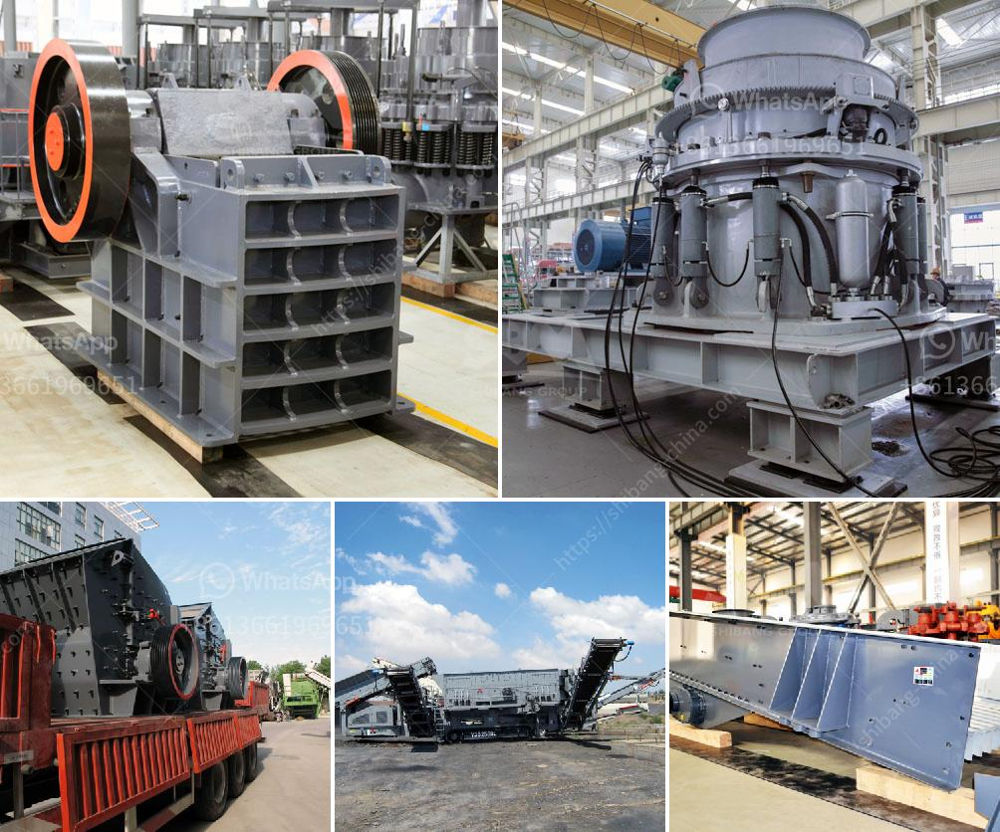

<h3>300tpd sponge iron machinery cost</h3>
The production of sponge iron, also known as direct reduced iron (DRI), is an important step in steel manufacturing processes. This high-quality iron ore substitute is widely used in various industries, including steel, foundry, and chemical.

Setting up a sponge iron plant requires a significant investment in machinery and infrastructure. One of the crucial components of this investment is the cost of 300tpd sponge iron machinery. In this article, we will explore this cost and its various aspects.

To start with, it is essential to understand the concept of tpd (tons per day). Tpd represents the capacity of a plant to produce a certain quantity of sponge iron in a day. In this case, 300tpd indicates that the plant can produce 300 tons of sponge iron per day.

The cost of 300tpd sponge iron machinery can vary depending on several factors. These factors include the technology used, the size of the plant, the quality of machinery, and the country of purchase. Generally, such machinery can range from $1.5 million to $5 million.

1. Rotary Kiln: This is the primary equipment used in the process. It is a large cylindrical furnace where iron ore is heated and reduced to sponge iron. The cost of a rotary kiln can range from $800,000 to $3 million, depending on its size and specifications.

2. Cooler: Once the sponge iron is produced, it needs to be cooled down before further processing. A cooler reduces the temperature of the iron from around 1000°C to 100°C. The cost of a cooler can vary from $200,000 to $800,000, depending on its capacity.

3. Magnetic Separator/Metal Detector: During the production process, it is essential to remove any impurities, such as metallic particles. A magnetic separator or metal detector is used for this purpose. The cost of such equipment can range from $50,000 to $150,000.

4. Briquetting Machine: Sponge iron, in its raw form, is too powdery to handle. It needs to be compacted into briquettes for easier transportation and storage. A briquetting machine is used for this purpose and can cost around $150,000 to $400,000.

5. Other auxiliary equipment: Apart from the main machinery mentioned above, there are various other auxiliary equipment required in a sponge iron plant, such as conveyors, crushers, screens, and raw material storage bins. The cost of these additional equipment can be around $500,000 to $1 million.

It is worth noting that the cost mentioned here is an approximate estimate and can vary depending on various factors. It is always recommended to get a detailed quotation from machinery suppliers before finalizing the purchase.

The cost of machinery is a significant component of setting up a sponge iron plant. However, it is important to consider other expenses such as land, infrastructure, water, power, and labor costs. Additionally, ongoing operational costs such as raw material, maintenance, and repair expenses should also be taken into account.

In conclusion, the cost of 300tpd sponge iron machinery can range from $1.5 million to $5 million, depending on various factors. It is crucial to conduct a thorough analysis and consider all the associated costs before making an investment decision.
<h3>Contact us</h3><ul><li><strong>Whatsapp:&nbsp;<a href="https://wa.me/8613661969651">+8613661969651</a></strong></li><li><a href="https://swt.shibang-china.com/?git&amp;zhl&amp;300tpd sponge iron machinery cost"><strong>Online Service(chat now)</strong></a></li></ul><h3>Related</h3><ul><li><a href='stone crusher machine price in kenya.md'>stone crusher machine price in kenya</a></li><li><a href='ball mill manufacturers in gujarat.md'>ball mill manufacturers in gujarat</a></li><li><a href='hammer mill furniture.md'>hammer mill furniture</a></li><li><a href='sand grinding mill japan for sale.md'>sand grinding mill japan for sale</a></li><li><a href='dolomite lime manufacturers in ghana.md'>dolomite lime manufacturers in ghana</a></li></ul>