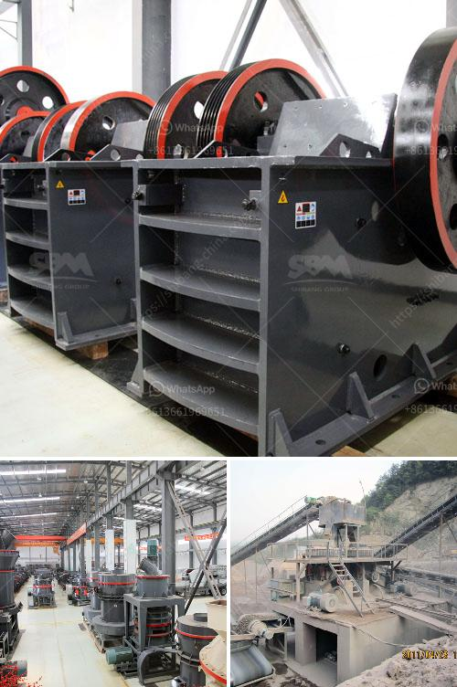

<h3>400 tph mobile coal crusher plant manufacturer</h3>
A mobile coal crusher plant is a crucial part in the construction industry. As the name suggests, it crushes the coal directly to the required size. This plant is primarily used to crush coal for combustion in the steam-generating furnaces of power plants. The mobile coal crusher plant manufacturer is keen on ensuring that their plant is technologically advanced, durable, and efficient.

They divide their mobile coal crusher plant into four different types: primary jaw crushers, primary impact crushers, secondary cone crushers, and tertiary impact crushers. These types of crushers provide different levels of performance, efficiency, and versatility. Each type is specialized for specific applications to provide superior results.

The primary jaw crushers have an opening that measures 1,100 by 900 millimeters, enabling the maximum feed size possible of 700 millimeters. The primary impact crushers, on the other hand, have an inlet of 1,200 by 1,000 millimeters and a maximum feed size of 800 millimeters. This allows for larger rocks to be fed into the crusher.

Secondary cone crushers have a larger feed size capacity than primary jaw crushers and primary impact crushers. They have an opening that measures 1,300 by 2,300 millimeters and a maximum feed size of 1,000 millimeters. This makes them ideal for crushing larger chunks of coal.

Finally, the tertiary impact crushers are designed for fine crushing applications. They have a maximum feed size of 150 millimeters and are capable of producing a product size of under 6 millimeters. This makes them suitable for producing coal fines for use in coal-fired power plants.

The mobile coal crusher plant manufacturer also offers screening and conveying equipment to help properly size and transport coal particles. These machines are efficient and can be easily incorporated into existing plants to increase production and reduce downtime. The mobile coal crusher plant manufacturer aims to take the worry out of making cement by providing innovative solutions that improve efficiency and reduce costs.

When choosing a manufacturer, it is important to consider factors such as reputation, experience, and customer service. The mobile coal crusher plant manufacturer should have a solid track record and be known for producing quality products that meet the industry's standards. Additionally, they should have a knowledgeable and responsive customer service team that is available to address any concerns or issues that may arise.

In conclusion, the mobile coal crusher plant manufacturer is constantly striving to create efficient, durable, and technologically advanced equipment for the coal mining industry. Their machines are capable of handling even the toughest materials, ensuring that coal is crushed to the desired size for use in power plants. By choosing a reputable manufacturer, companies can rest assured that they are investing in a reliable and high-quality product.
<h3>Contact us</h3><ul><li><strong>Whatsapp:&nbsp;<a href="https://wa.me/8613661969651">+8613661969651</a></strong></li><li><a href="https://swt.shibang-china.com/?git&amp;zhl&amp;400 tph mobile coal crusher plant manufacturer"><strong>Online Service(chat now)</strong></a></li></ul><h3>Related</h3><ul><li><a href='limestone powder making machine.md'>limestone powder making machine</a></li><li><a href='vibrating screens manufacturers.md'>vibrating screens manufacturers</a></li><li><a href='basalt impact crusher price.md'>basalt impact crusher price</a></li><li><a href='crushing to micron sized powder.md'>crushing to micron sized powder</a></li><li><a href='how to build a hammer mill.md'>how to build a hammer mill</a></li></ul>