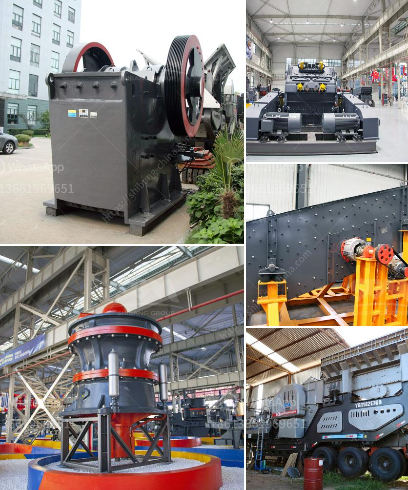

<h3>50 tph stone crusher plant</h3>
The stone crusher plant is used for producing sand, rock and stone for construction, highway, railway and other applications. Fote Heavy Machinery, with 40 years of experience in the stone crushing production line, is skilled in the production line process design and has a high-cost performance.

Fote stone crusher plant and stone crushing equipment have been sold to hundreds of countries, such as India, Pakistan, Indonesia, Nigeria, Kenya, the USA, Ghana, Zimbabwe, Nepal, Philippines, the UK, Vietnam, Iceland, Canada, etc. Is stone crusher plant a profitable business？

The stone crusher plant is a machine used to crush rocks into smaller pieces, usually for gravel or some other road or building application. Most stone crusher plants have a capacity range of at least 1 tph. This principle gives stone crusher plants a long lifespan and a high value return.

Stone crusher plant machine: Silo, ZSW490x110 vibrating feeder, PE750x1060 jaw crusher, B1000x24 m belt conveyor (Two sets), HXGYS400 hydraulic cone crusher, HXVSI1140 sand making machine, B1000x30 m belt conveyor, 4YK2460 vibrating screen, B650x44 m belt conveyor (Two sets), B800x10 m belt conveyor.

Оne of the most important things to remember as you explore opportunities for a new stone crusher plant is that it’s a disciplined investment. At Fote, we believe that, wherever you are in your business cycle, there’s never a bad time to invest in quality equipment. This is why we list some typical solutions for customers. They range from smaller market-specific investments to larger, strategic investments for operations that are processing larger quantities of material or that have year-round production requirements.

- 50tph stone crushing plant equipment: Jaw Crusher, impact crusher, vibrating screen, vibrating feeder, belt conveyor.

- Future Market Of Quarry Plant Population Growth, economic development, global urbanization, three factors to promote the growth of global demand for crushed stone. At the subregional level, demand for sand and gravel is growing fastest in Asia, particularly in India, Africa and Latin America. Building construction, road construction, and other infrastructure construction projects are the most important factors that promote the development of the sand and gravel industry.

Over 50% of the demand for gravel is used for road construction, while 20% is used for housing construction, and 10% is used for industrial construction. About 855,000 miles of roads in the United States are paved, and the demand for crushed stone is increasing before the road construction season starts.

In Europe, the total production is greater than 500 million tons per year. In Central Europe, the best aggregates are extracted in hard rock quarries. In processes like this, River Stone, Sand & Gravel, Concrete & Construction Waste Crushing, etc. are the best application areas. There is a lack of equipment in secondary crushing and tertiary crushing in the country. In addition, to meet the needs of different types of customers, the output can be changed by adjusting the grate gap and the material can be selectively crushed.

As a leading mining machinery manufacturer and exporter in China, we are always here to provide you with high quality products and better services. Welcome to contact us through one of the following ways or visit our company and factories.

No matter what your stone crushing needs are, Fote Heavy Machinery can surely provide the right solution for you. Your satisfaction is our ultimate goal!

We believe that our customer site visits and installations can be equally successful, reflecting the expertise of our engineers in tailoring the most effective solutions for our clients. And the stone crusher used to make ballast is called ballast crusher.

It could be jaw crusher machine, cone crusher machine, vertical shaft impact crusher machine etc. There are series of cone crushers for sale in crushing plant Kenya. We had better choose stone cone crusher types according to stone crusher equipment. Cone crusher is a second stage crushing machine for very hard rock. To make high quality ballast,Baichy cone crusher is a good choice. It has some advantages compared to other kind of stone crushers.
<h3>Contact us</h3><ul><li><strong>Whatsapp:&nbsp;<a href="https://wa.me/8613661969651">+8613661969651</a></strong></li><li><a href="https://swt.shibang-china.com/?git&amp;zhl&amp;50 tph stone crusher plant"><strong>Online Service(chat now)</strong></a></li></ul><h3>Related</h3><ul><li><a href='limestone processing plant supplier.md'>limestone processing plant supplier</a></li><li><a href='sand washing plant suppliers.md'>sand washing plant suppliers</a></li><li><a href='size maya size of a stone crusher.md'>size maya size of a stone crusher</a></li><li><a href='ultrafine vertical roller mill.md'>ultrafine vertical roller mill</a></li><li><a href='used crusher plant in dubai for sale.md'>used crusher plant in dubai for sale</a></li></ul>