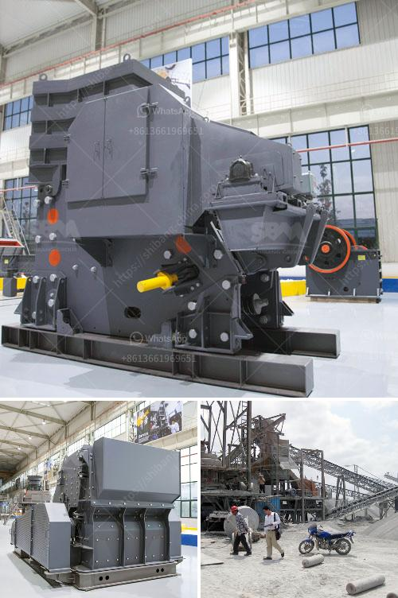

<h3>60ton ball mill nigeria</h3>
Nigeria is known for its rich mineral wealth, with vast reserves of high-quality raw materials like limestone, coal, zinc, bitumen, gypsum, and tantalite. These resources have been largely untapped, creating a huge opportunity for investors and businesses to harness and maximize the potential.

In line with this, Nigeria recently unveiled its largest ball mill - a massive 60-ton machine with incredible capabilities for grinding and crushing materials. This powerful equipment is designed and manufactured by a leading local engineering firm, in collaboration with international partners, to cater to the growing demand for ball mills in Nigeria's mining industry.

The 60-ton ball mill boasts remarkable efficiency, reliability, and durability. With a powerful motor and a simplified control system, it grinds large quantities of materials with ease, ensuring peak performance throughout its operation. The machine is adept at processing various types of raw materials, including limestone, quartz, coal, and ores, making it versatile and suitable for a wide range of applications.

One of the key advantages of this 60-ton ball mill is its ability to handle large quantities of materials at once. This high capacity enables mining and manufacturing companies to produce significantly more output within a shorter time frame, increasing productivity and profitability. Additionally, the machine's robust design and build quality ensure minimal downtime and reduced maintenance costs, making it an efficient and cost-effective investment for businesses.

Moreover, the 60-ton ball mill aligns with Nigeria's vision for local content development. It represents a significant milestone in the nation's journey towards achieving self-sufficiency in machinery and equipment production. By partnering with local engineering firms and leveraging global expertise, Nigeria is able to manufacture state-of-the-art machinery like this ball mill, driving economic growth and creating high-quality jobs for its citizens.

Furthermore, this new ball mill supports Nigeria's goal of diversifying its economy beyond oil and gas. The mining sector presents immense potential for contributing to the country's GDP and creating a more sustainable and inclusive economy. With the increased beneficiation of raw materials through ball milling technology, Nigeria can attract more investors and stimulate growth in industries such as cement production, iron and steel manufacturing, and glassmaking.

However, the installation of the 60-ton ball mill is just the beginning of Nigeria's journey towards optimizing its vast mineral resources. To fully harness the potential of the mining industry, the government must focus on providing an enabling environment for businesses to thrive. This includes streamlining mining regulations, addressing infrastructure challenges, and enhancing security measures across mining sites.

In conclusion, Nigeria's introduction of the 60-ton ball mill is a significant step towards unlocking the nation's mineral wealth and transforming its economy. With its high capacity, efficiency, and durability, this powerful machine can revolutionize the mining and manufacturing sectors in Nigeria. By embracing local content development and attracting investments, Nigeria can position itself as a major player in the global mining industry and accelerate economic growth and development.
<h3>Contact us</h3><ul><li><strong>Whatsapp:&nbsp;<a href="https://wa.me/8613661969651">+8613661969651</a></strong></li><li><a href="https://swt.shibang-china.com/?git&amp;zhl&amp;60ton ball mill nigeria"><strong>Online Service(chat now)</strong></a></li></ul><h3>Related</h3><ul><li><a href='gold mining used jaw crusher.md'>gold mining used jaw crusher</a></li><li><a href='quartz powder suppliers in dubai.md'>quartz powder suppliers in dubai</a></li><li><a href='ultra fine mill manufacturers in india.md'>ultra fine mill manufacturers in india</a></li><li><a href='long distance conveyor of lafarge cement in bangladesh.md'>long distance conveyor of lafarge cement in bangladesh</a></li><li><a href='mill price for minerals in bolivia.md'>mill price for minerals in bolivia</a></li></ul>