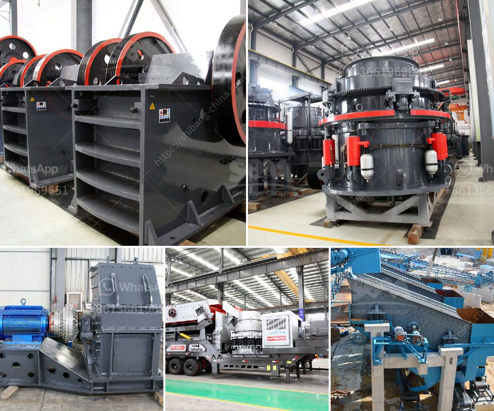

<h3>aggregate conveyor systems</h3>
In the construction industry, efficiency and productivity are key factors in completing projects on time and within budget. One crucial aspect of construction is the movement of aggregates, which are essential building materials like sand, gravel, crushed stone, and recycled concrete. These materials need to be transported from one location to another quickly and efficiently, and that's where aggregate conveyor systems come into play.

Aggregate conveyor systems are an integral part of any construction operation as they provide a safe and efficient method of transporting aggregates from one place to another. These systems consist of a series of belts, with pulleys at regular intervals, that carry the materials along a designated path. They can be made of rubber, fabric, or metal, depending on the specific requirements of the construction project.

One advantage of aggregate conveyor systems is their ability to move a large quantity of materials over long distances in a short amount of time. This eliminates the need for manual labor, which not only saves time but also reduces the risk of injury to workers. By automating the transportation process, construction companies can boost productivity and meet tight deadlines more effectively.

Another benefit of using aggregate conveyor systems is their versatility. They can be easily adjusted to fit different angles and heights, allowing for seamless integration into various construction sites. Whether it's moving materials up a steep incline or around tight corners, these systems can adapt to the terrain, resulting in a more streamlined workflow. Additionally, some conveyor systems can be installed with telescopic arms or adjustable heights, further enhancing their flexibility.

Safety is always a top priority in the construction industry, and aggregate conveyor systems are designed with this in mind. They often come equipped with safety features such as emergency stop buttons, belt alignment sensors, and overload protection. These mechanisms ensure that any potential hazards are promptly addressed, minimizing the risk of accidents and injuries.

Maintenance is another key aspect to consider when using aggregate conveyor systems. Regular inspections and routine maintenance can extend the lifespan of the system and prevent unexpected breakdowns. Lubrication, belt tension adjustments, and cleaning are some of the maintenance tasks that should be carried out regularly to keep the system running smoothly.

In conclusion, aggregate conveyor systems are essential tools in the construction industry. They provide a safe, efficient, and versatile method of transporting aggregates, saving both time and money in the process. By automating the transportation process, construction companies can enhance productivity, meet deadlines, and improve overall project efficiency. With proper maintenance and attention to safety, aggregate conveyor systems can continue to be valuable assets to the construction industry for years to come.
<h3>Contact us</h3><ul><li><strong>Whatsapp:&nbsp;<a href="https://wa.me/8613661969651">+8613661969651</a></strong></li><li><a href="https://swt.shibang-china.com/?git&amp;zhl&amp;aggregate conveyor systems"><strong>Online Service(chat now)</strong></a></li></ul><h3>Related</h3><ul><li><a href='3 roll mill specifications.md'>3 roll mill specifications</a></li><li><a href='used stone crushers in south africa in zambia.md'>used stone crushers in south africa in zambia</a></li><li><a href='how much does a mobile crusher cost.md'>how much does a mobile crusher cost</a></li><li><a href='limestone processing plant company.md'>limestone processing plant company</a></li><li><a href='marbel grinder price in pakistan.md'>marbel grinder price in pakistan</a></li></ul>