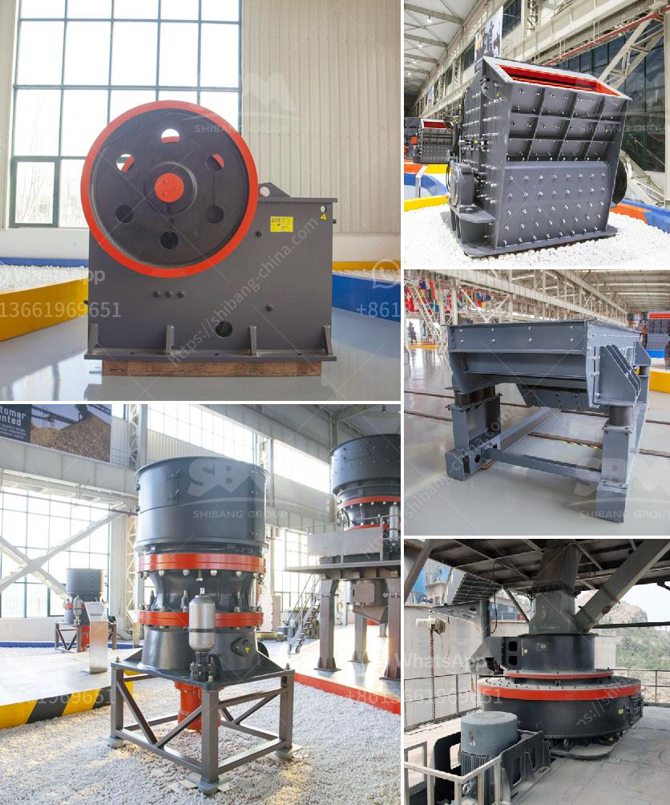

<h3>aggregate crusher supplier tanzania</h3>
Aggregate is a wide category of coarse particulate material used in construction, including sand, gravel, crushed stone, slag, recycled concrete, and geosynthetic aggregates. Aggregates are the most mined materials in the world, making this an essential resource for the construction industry. With an increasing demand for construction materials, Tanzania has seen an upsurge in aggregate production.

When it comes to aggregate crushers, there are many options available in the market. Finding a reliable and trustworthy supplier is crucial to ensure the quality of the product and efficient production. Tanzania has several aggregate crusher suppliers, such as Amarshiva Engineering Company. Amarshiva Engineering Company is a well-established aggregate crusher supplier in Tanzania and provides high-quality products and services to its customers.

Amarshiva Engineering Company offers a variety of aggregate crushers that are designed to crush materials such as granite, basalt, limestone, river pebbles, etc. Their crushers are available in different models, sizes, and capacities to meet the diverse needs of their customers. These crushers are known for their robust construction, high efficiency, and long service life.

One of the key advantages of choosing Amarshiva Engineering Company as an aggregate crusher supplier is their expertise and experience in the field. With years of experience, they understand the unique requirements of the construction industry and provide tailor-made solutions to their customers. Their team of skilled professionals ensures that each crusher is built with precision and care to deliver optimum performance.

In addition to providing high-quality crushers, Amarshiva Engineering Company also offers aftermarket support and services. They provide timely maintenance and repair services to ensure that the crushers are always in optimal condition. This helps their customers minimize downtime and maximize production efficiency.

Amarshiva Engineering Company is dedicated to customer satisfaction and aims to build long-lasting relationships with their clients. They believe in transparency, integrity, and professionalism, which is reflected in their work. Being a customer-centric organization, they prioritize the needs and requirements of their clients and deliver products and services that meet their expectations.

Choosing the right aggregate crusher supplier is essential for the success of any construction project. Amarshiva Engineering Company’s commitment to quality, reliability, and customer satisfaction has made them a trusted supplier in Tanzania. Their focus on innovation and continuous improvement ensures that their crushers are at the forefront of the industry.

In conclusion, when it comes to finding a reliable aggregate crusher supplier in Tanzania, Amarshiva Engineering Company stands out. Their commitment to delivering high-quality products, exceptional service, and customer satisfaction sets them apart from their competitors. Through their expertise and experience, they have gained the trust and reputation of being a leading supplier in the industry. Whether it is for small-scale construction projects or large-scale infrastructure development, Amarshiva Engineering Company is the go-to supplier for aggregate crushers in Tanzania.
<h3>Contact us</h3><ul><li><strong>Whatsapp:&nbsp;<a href="https://wa.me/8613661969651">+8613661969651</a></strong></li><li><a href="https://swt.shibang-china.com/?git&amp;zhl&amp;aggregate crusher supplier tanzania"><strong>Online Service(chat now)</strong></a></li></ul><h3>Related</h3><ul><li><a href='used stone crusher in nairobi.md'>used stone crusher in nairobi</a></li><li><a href='capital requirement for one ton cement mill.md'>capital requirement for one ton cement mill</a></li><li><a href='mini crusher for gravel sale in philippines.md'>mini crusher for gravel sale in philippines</a></li><li><a href='quotation for impact crusher.md'>quotation for impact crusher</a></li><li><a href='crusher machine quarry crusher.md'>crusher machine quarry crusher</a></li></ul>