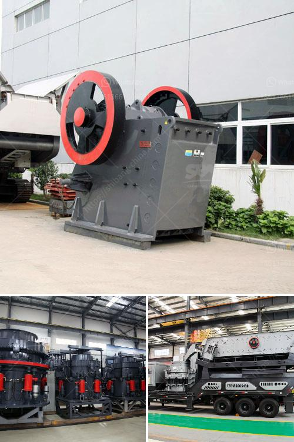

<h3>aggregate crushers for sale saudi arabia</h3>
Aggregate crushers are commonly used in the construction industry to break down and recycle materials such as rocks, concrete, and asphalt. In Saudi Arabia, the demand for aggregates is continuously growing due to the rapid infrastructure development in the country. The aggregate crushers for sale in Saudi Arabia can be used to crush rock, gravel, marble, granite, limestone, and other materials.

The high-quality aggregates produced by these crushers are essential for construction projects, road building, and infrastructure development in Saudi Arabia. Therefore, these crushers are highly sought after in the local market.

In recent years, the Saudi government has been investing heavily in infrastructure projects and the construction sector. This has resulted in a surge in demand for aggregate crushers, as they are crucial for the production of construction materials. The crushers enable the processing of raw materials into smaller sizes suitable for various applications.

Saudi Arabia is known for its extensive oil reserves, but the government is also focusing on diversifying its economy. As a result, there is an increased emphasis on infrastructure development, such as building roads, bridges, and other infrastructure projects. This has led to a growing demand for high-quality aggregate materials.

The aggregate crushers for sale in Saudi Arabia can provide different sizes of aggregates, such as sand, gravel, and limestone. The use of these materials in construction projects offers significant benefits, including improved durability, better workability, and reduced project costs.

Saudi Arabia has abundant natural resources, including minerals and metals. The crushers for sale in Saudi Arabia are essential for the mining industry, , as they crush and process mineral resources such as gold, copper, iron ore, and limestone. The crushers are more versatile when compared to traditional crushers, as they can process a wide range of materials.

In conclusion, aggregate crushers in Saudi Arabia have a crucial role in the construction industry. The crushers are essential for the production of high-quality aggregates, which are in high demand for various infrastructure projects. The crushers can process different types of materials, making them highly versatile and suitable for a wide range of applications. As the Saudi Arabian government continues to invest in infrastructure development, the demand for aggregate crushers is expected to remain strong, making it an attractive market for sellers and buyers.
<h3>Contact us</h3><ul><li><strong>Whatsapp:&nbsp;<a href="https://wa.me/8613661969651">+8613661969651</a></strong></li><li><a href="https://swt.shibang-china.com/?git&amp;zhl&amp;aggregate crushers for sale saudi arabia"><strong>Online Service(chat now)</strong></a></li></ul><h3>Related</h3><ul><li><a href='gold plant for sale philippines.md'>gold plant for sale philippines</a></li><li><a href='gypsum manufacturing unit in nigeria.md'>gypsum manufacturing unit in nigeria</a></li><li><a href='mobile screening plant for sale.md'>mobile screening plant for sale</a></li><li><a href='river pebble crusher manufacturer.md'>river pebble crusher manufacturer</a></li><li><a href='ghana quarry crusher.md'>ghana quarry crusher</a></li></ul>