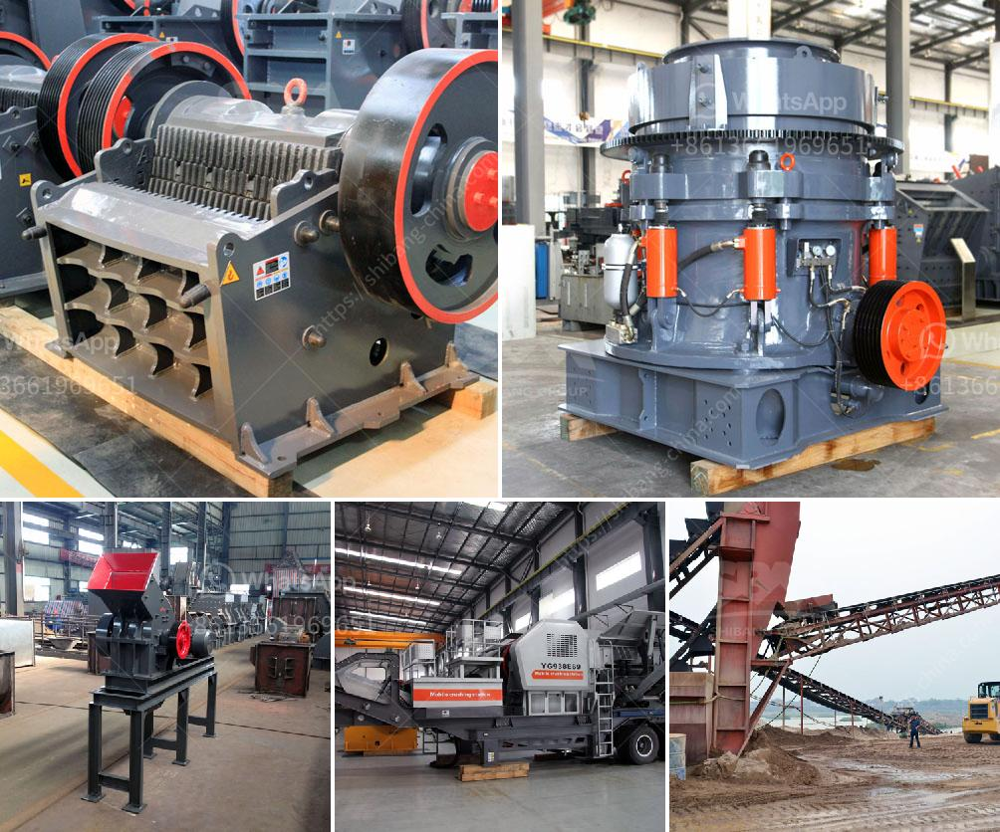

<h3>aggregate crushing flow chart</h3>
Aggregate crushing flow charts are crucial for the production of high-quality aggregate materials. They facilitate the understanding of the process and highlight the steps that are necessary to achieve the desired end product. Manufacturers in various industries use aggregate crushing charts to evaluate the efficiency of their processes and improve productivity.

The flow chart begins with the introduction of raw materials, such as rocks or gravel, into a crusher. The machine crushes and screens the raw materials to separate them into different sizes. The aggregate with the desired size is then transported to a stockpile or conveyed to a designated location for further processing.

The flow chart typically includes key process equipment, such as crushers, screens, conveyors, and feeders. Each equipment plays a crucial role in the aggregate production process, and their proper functioning ensures the final product meets the required specifications. The flow chart also incorporates various stages, such as primary crushing, secondary crushing, and tertiary crushing. These stages further break down the raw materials into smaller sizes.

Aggregate crushing flow charts enhance operational efficiency by minimizing downtime and optimizing production. Manufacturers can monitor the progress of each stage and identify potential bottlenecks or malfunctions. This allows them to take corrective actions promptly, preventing costly delays and ensuring smooth operation.

Moreover, aggregate crushing flow charts provide valuable insights regarding the overall process efficiency. By analyzing the flow of materials, manufacturers can assess the consumption of power, energy, and other resources. This enables them to identify areas for improvement and implement measures to reduce energy consumption and environmental impact.

In conclusion, aggregate crushing flow charts are indispensable tools in the manufacturing industry. They guide the production process, facilitate efficient operation, and promote environmental consciousness. Manufacturers that utilize such charts can optimize their processes, increase productivity, and deliver high-quality aggregate materials.
<h3>Contact us</h3><ul><li><strong>Whatsapp:&nbsp;<a href="https://wa.me/8613661969651">+8613661969651</a></strong></li><li><a href="https://swt.shibang-china.com/?git&amp;zhl&amp;aggregate crushing flow chart"><strong>Online Service(chat now)</strong></a></li></ul><h3>Related</h3><ul><li><a href='cone crushers manufacturer.md'>cone crushers manufacturer</a></li><li><a href='gypsum powder production process in india pdf.md'>gypsum powder production process in india pdf</a></li><li><a href='cone crusher equipment.md'>cone crusher equipment</a></li><li><a href='financial projections for a ore mining company.md'>financial projections for a ore mining company</a></li><li><a href='how to build a hammer mill.md'>how to build a hammer mill</a></li></ul>