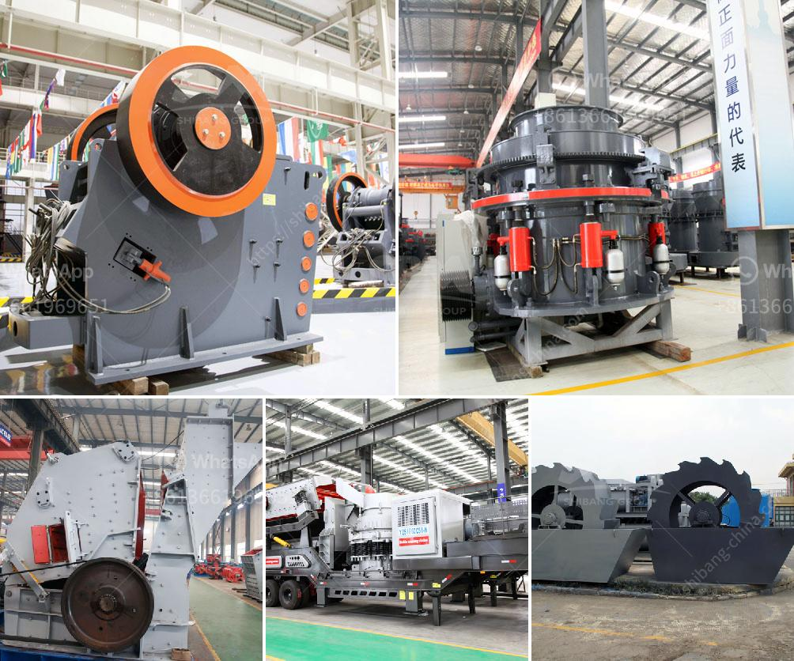

<h3>aggregate crushing machine portable</h3>
Aggregate crushing machines are used to break down large pieces of rock into smaller, more manageable sizes. These machines are invaluable for the construction industry, as they provide the vital aggregates required for concrete production, as well as for road construction, asphalt production, and other similar projects. With advancements in technology, portable aggregate crushing machines have become widely popular due to their ease of transportation and versatility.

One of the biggest advantages of portable aggregate crushing machines is their flexibility. These machines can be easily transported to and from job sites, enabling contractors to quickly set up the crushing equipment wherever it is needed. This eliminates the need for expensive transportation of materials to a fixed crusher location, saving both time and money. Additionally, the mobility of these machines allows contractors to take advantage of aggregate resources at various locations, ensuring a steady supply of material for their projects.

Another key benefit of portable aggregate crushing machines is their ability to handle a wide range of materials. These machines are designed to crush different types of rock, such as limestone, granite, or basalt, to produce high-quality aggregates. The versatility of these machines enables contractors to process various materials on-site, eliminating the need to rely on third-party suppliers for specific types of aggregates. This not only increases efficiency but also ensures that the desired specifications for the aggregates are met.

Portable aggregate crushing machines are also known for their high productivity. These machines are designed to handle large volumes of material, allowing contractors to complete their projects faster. The crushing process is quick and efficient, ensuring that a significant amount of material can be processed within a short period. This enables contractors to meet tight project deadlines while maintaining the quality of the aggregates produced.

Furthermore, portable aggregate crushing machines have a lower impact on the environment compared to fixed crushers. With the ability to move from one site to another, these machines reduce the need for long-haul transportation of materials, reducing carbon emissions. Additionally, the advanced design of portable crushing machines includes features such as dust suppression systems, which minimize airborne dust and improve air quality at job sites.

In conclusion, portable aggregate crushing machines offer numerous benefits to contractors in the construction industry. With their ease of transportation, versatility, and ability to handle different types of materials, these machines enable contractors to efficiently produce high-quality aggregates on-site. Furthermore, their high productivity and lower environmental impact make them a valuable asset for any construction project. As technology continues to advance, portable aggregate crushing machines are likely to become even more efficient and versatile, further improving the construction process.
<h3>Contact us</h3><ul><li><strong>Whatsapp:&nbsp;<a href="https://wa.me/8613661969651">+8613661969651</a></strong></li><li><a href="https://swt.shibang-china.com/?git&amp;zhl&amp;aggregate crushing machine portable"><strong>Online Service(chat now)</strong></a></li></ul><h3>Related</h3><ul><li><a href='crushing machine manufacturer.md'>crushing machine manufacturer</a></li><li><a href='cost of dolomite milling machine in india.md'>cost of dolomite milling machine in india</a></li><li><a href='crusher plant manufacturer.md'>crusher plant manufacturer</a></li><li><a href='jaw crushing machine.md'>jaw crushing machine</a></li><li><a href='coal crushing machine.md'>coal crushing machine</a></li></ul>