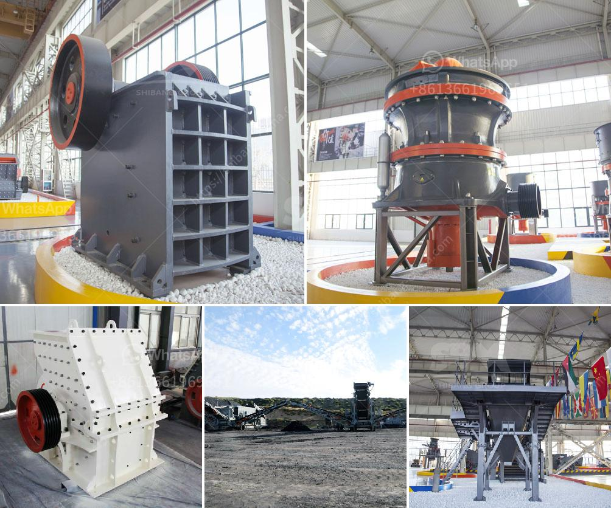

<h3>aggregate crushing machines</h3>
Aggregate crushing machines are used to convert large rocks into smaller pieces that are suitable for construction purposes. These machines utilize heavy-duty jaws or impactors that break down the material into smaller pieces. Crushing machines make it possible to utilize large pieces of rock and transform them into smaller aggregate sizes that are ideal for construction projects.

One of the primary uses of aggregate crushing machines is to produce aggregate for construction purposes. These machines crush large rocks into smaller pieces, allowing the material to be used in various construction projects. This includes creating foundations, road bases, and even concrete production. The different sizes of aggregate produced by crushing machines allow for flexibility in selecting the appropriate material for specific applications.

Aggregate crushing machines come in various types and configurations. Jaw crushers are particularly popular among construction companies due to their versatility and ability to handle large rocks. These machines have a stationary jaw and a movable jaw, which work together to crush the material. The movable jaw exerts force on the rock, breaking it into smaller pieces. Another popular type is the impact crusher, which utilizes a series of blow bars to crush the material. These blow bars strike the rock and break it into smaller pieces.

Different aggregate crushing machines have different advantages. Jaw crushers are known for their ease of use and ability to run continuously, making them ideal for large-scale aggregate production. On the other hand, impact crushers are popular for their higher reduction ratios and ability to produce finer, more consistent aggregate sizes. Each type of machine offers unique benefits and is suited for different applications.

The process of crushing aggregate involves feeding the material into the machine, which then crushes it into smaller pieces. This is typically achieved by using a primary crusher, such as a jaw crusher or impact crusher, followed by a secondary crusher to further reduce the material size. Vibrating screens are often used to separate the crushed material into different sizes based on its particle size distribution.

Aggregate crushing machines require regular maintenance to ensure their proper functioning. This includes inspecting the machine for any damage or wear, lubricating the moving parts, and replacing any worn-out components. Proper maintenance not only improves the longevity of the machine but also ensures its optimal performance. It is essential to follow the manufacturer's guidelines and recommendations to ensure the safe and efficient operation of these machines.

In conclusion, aggregate crushing machines play a crucial role in the construction industry by converting large rocks into smaller aggregate sizes. These machines are used to produce material for various construction purposes, including foundations, road bases, and concrete production. With different types and configurations available, these machines offer versatility and flexibility in selecting the appropriate material for specific applications. Regular maintenance is essential to ensure the proper functioning and longevity of these machines. Consumer satisfaction with the quality of the aggregate produced by these machines is often the primary goal of construction companies, making them an indispensable tool in the industry.
<h3>Contact us</h3><ul><li><strong>Whatsapp:&nbsp;<a href="https://wa.me/8613661969651">+8613661969651</a></strong></li><li><a href="https://swt.shibang-china.com/?git&amp;zhl&amp;aggregate crushing machines"><strong>Online Service(chat now)</strong></a></li></ul><h3>Related</h3><ul><li><a href='mini crusher for gravel sale in philippines.md'>mini crusher for gravel sale in philippines</a></li><li><a href='gypsum powder production process in india pdf.md'>gypsum powder production process in india pdf</a></li><li><a href='impact crushers turkey.md'>impact crushers turkey</a></li><li><a href='types of grinding mills.md'>types of grinding mills</a></li><li><a href='calcite crushing equipment.md'>calcite crushing equipment</a></li></ul>