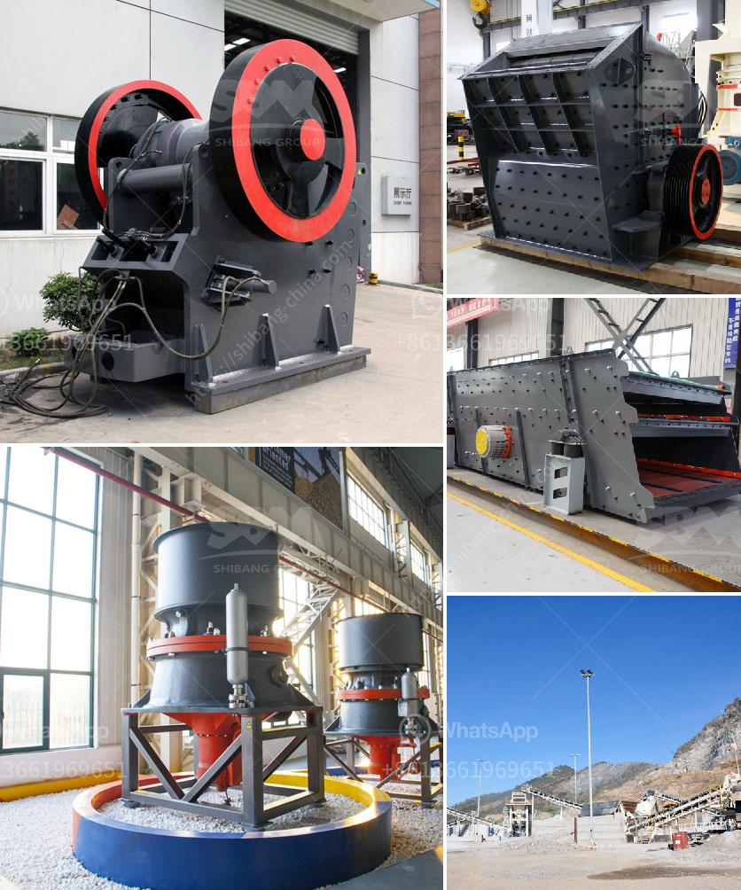

<h3>aggregate crushing plant layout</h3>
Aggregate crushing plant layout is important for many construction projects, especially ones that involve crushing rocks and stones like basalt or granite. These plants are used in various industries, including mining and construction. Since the crushing plant layout is crucial in these industries, it needs to be designed with care and precision.

The first factor that comes into play in designing the layout is the raw materials. These plants usually require rocks and stones as input materials to be crushed into smaller sizes for further processing or use. The type and size of the raw materials will determine the size and configuration of the crushing equipment.

Another important factor is the production capacity required. The layout should be able to accommodate the desired production capacity efficiently. It should be designed to avoid bottlenecks or congestion in the flow of materials, ensuring a smooth and continuous operation.

The layout should also take into consideration the specific requirements of the final product. Different types of crushers and screens may be required to achieve the desired specifications. The layout should include enough space for these equipment as well as the necessary conveyors and other components.

Safety is of utmost importance in any crushing plant layout. Adequate space and safety measures should be included to ensure the safety of the workers and the equipment. Guards, barriers, and warning signs should be installed where necessary. Easy access to all parts of the plant for maintenance and repairs should also be considered in the layout.

Efficiency is also a key consideration in the design of the layout. The flow of materials should be optimized to minimize transportation and handling costs. This can be achieved by positioning the crushers and screens strategically along the process flow. Adequate stockpiling space should be included to ensure a steady supply of materials to the crushers.

Environmental considerations should not be neglected in the layout design. The plant should be located in an area that minimizes the impact on the environment, such as noise and dust pollution. Dust control measures and sound dampening structures should be incorporated in the design to mitigate these issues.

In conclusion, the layout of an aggregate crushing plant is crucial for efficient and effective production. It needs to be designed with consideration for the specific requirements of the raw materials, production capacity, final product specifications, safety, efficiency, and environmental impact. By carefully addressing these factors, a well-designed layout can help maximize productivity and minimize costs in a crushing plant.
<h3>Contact us</h3><ul><li><strong>Whatsapp:&nbsp;<a href="https://wa.me/8613661969651">+8613661969651</a></strong></li><li><a href="https://swt.shibang-china.com/?git&amp;zhl&amp;aggregate crushing plant layout"><strong>Online Service(chat now)</strong></a></li></ul><h3>Related</h3><ul><li><a href='component of ball mill and its working principle.md'>component of ball mill and its working principle</a></li><li><a href='machine that crushes stones to ballast.md'>machine that crushes stones to ballast</a></li><li><a href='150 tph mobile jaw crusher for sale in malaysia.md'>150 tph mobile jaw crusher for sale in malaysia</a></li><li><a href='mining heavy equipment price list.md'>mining heavy equipment price list</a></li><li><a href='roller mill in india.md'>roller mill in india</a></li></ul>