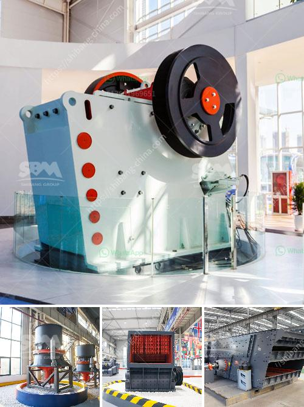

<h3>aggregate jaw crushers saudi</h3>
Aggregate jaw crushers are widely used in mines, construction projects, and other industrial applications. In order to meet the needs of different customers, we have developed various types of jaw crushers, such as PE jaw crusher, PEW European jaw crusher, HD German jaw crusher, etc. These products are not only reliable in quality, but also affordable in price, making them the preferred equipment for crushing rock materials.

One of the main advantages of aggregate jaw crushers is their ability to process large feed sizes. The typical feed opening of our jaw crushers can reach up to 1500 mm, which can easily handle large rocks and provide a smooth flow of material for subsequent crushing processes. This allows for greater productivity and efficiency in the crushing operation.

Additionally, the design of our jaw crushers ensures that the crushing chamber is deep and symmetrical, which promotes even feeding of material and a higher crushing ratio. This results in a finer product size with less needle-like particles, making it suitable for the production of high-quality aggregates.

Another feature of our aggregate jaw crushers is their excellent reliability. Our crushers are equipped with advanced technologies, such as high-strength bearings, finite element analysis techniques, and optimized toggle plates, which ensure that the machines operate smoothly and efficiently even under demanding conditions. This not only reduces maintenance and downtime but also extends the service life of the equipment.

Moreover, our aggregate jaw crushers are highly versatile and can be used in various applications. They can effectively crush different types of rocks, including granite, basalt, limestone, quartzite, and more. This makes them suitable for a wide range of industries, such as mining, construction, road building, chemical engineering, and metallurgy.

In addition to their excellent performance, our aggregate jaw crushers are also easy to operate and maintain. They are equipped with user-friendly control systems and safety devices, making them safe and convenient to use. Furthermore, all the wearing parts of the crushers are easily replaceable, allowing for quick and cost-effective maintenance.

Lastly, but equally important, is the affordability of our aggregate jaw crushers. We understand the budget constraints of our customers, which is why we strive to provide high-quality equipment at competitive prices. Our jaw crushers are not only cost-effective to purchase, but also economical to operate and maintain in the long run.

In conclusion, aggregate jaw crushers with their large feed opening, reliable performance, versatile applications, and ease of operation and maintenance, are the ideal choice for crushing rock materials. Whether it's for mining, construction, or any other industrial application, our jaw crushers offer high productivity, efficiency, and cost-effectiveness. With our commitment to quality and customer satisfaction, we are confident that our crushers will exceed your expectations and help you achieve your crushing goals.
<h3>Contact us</h3><ul><li><strong>Whatsapp:&nbsp;<a href="https://wa.me/8613661969651">+8613661969651</a></strong></li><li><a href="https://swt.shibang-china.com/?git&amp;zhl&amp;aggregate jaw crushers saudi"><strong>Online Service(chat now)</strong></a></li></ul><h3>Related</h3><ul><li><a href='graphite processing plant.md'>graphite processing plant</a></li><li><a href='print hammer mill.md'>print hammer mill</a></li><li><a href='list price vibrating screen.md'>list price vibrating screen</a></li><li><a href='iron processing equipment price.md'>iron processing equipment price</a></li><li><a href='working principle of raw mill in cement plant.md'>working principle of raw mill in cement plant</a></li></ul>