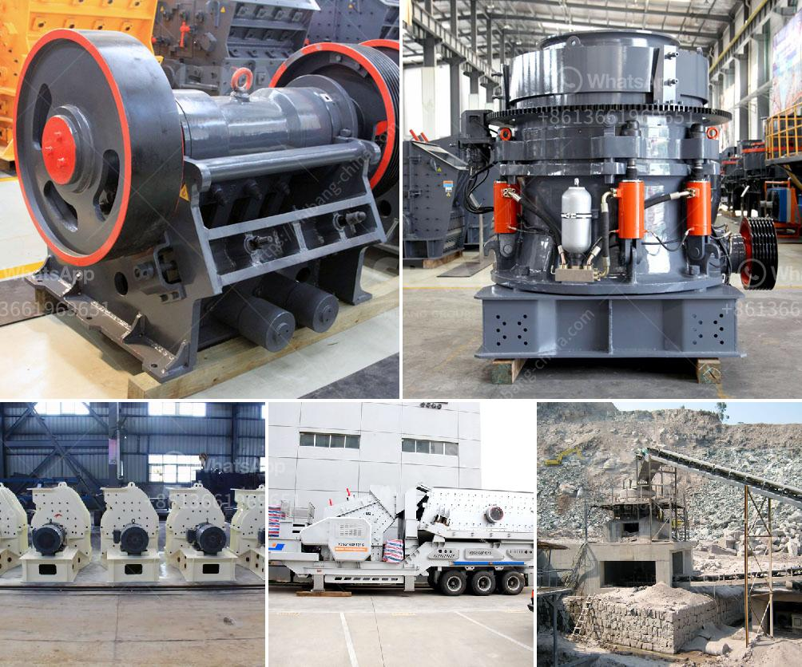

<h3>aggregate machine in south africa</h3>
South Africa's construction industry has seen substantial growth in recent years, thanks to the government's emphasis on infrastructure development and urbanization. This surge in construction activities has created a need for efficient and advanced machinery to meet the rising demand for aggregates, which are essential components in the production of concrete, asphalt, and other construction materials. The introduction of aggregate machines in South Africa has been crucial in ensuring the smooth operation of construction projects and meeting the country's infrastructure needs.

Aggregate machines, commonly known as crushers, are heavy-duty equipment designed to break large rocks and stones into smaller fragments, known as aggregates. These aggregates serve as the foundation for roads, structures, and other construction projects. The utilization of aggregate machines in South Africa's construction industry has several advantages.

Firstly, aggregate machines improve the efficiency and speed of construction projects. With their powerful mechanisms and cutting-edge technology, these machines can handle large quantities of rocks and stones, reducing the time and effort required for manual labor. This translates into more significant savings in labor costs and improved project timelines.

Another significant benefit of aggregate machines is their ability to produce consistent and high-quality aggregates. This is crucial in construction, as the quality of aggregates impacts the durability and strength of the final product. The machines' advanced crushing techniques ensure uniform particle size and shape, resulting in better bonding between the aggregates and other construction materials. Such consistency guarantees the longevity and reliability of the structures being built.

Moreover, aggregate machines ensure environmental sustainability. By crushing large rocks and stones, these machines enable the recycling and reuse of materials that would otherwise be wasted. In a country like South Africa, where environmental concerns are increasingly prominent, the use of aggregate machines aligns with the government's efforts to promote eco-friendly construction practices.

Additionally, the introduction of aggregate machines has created opportunities for job creation and economic growth. The operation and maintenance of these machines require skilled individuals, contributing to employment in the construction and machinery sectors. As the construction industry expands, so does the demand for aggregate machines, leading to increased manufacturing and local production of these essential tools. This, in turn, strengthens the economy and promotes industrial growth.

However, there are challenges faced in South Africa regarding the utilization of aggregate machines. One such challenge is the accessibility and affordability of these machines. Many construction companies, especially small and medium-sized enterprises, struggle to acquire the necessary machinery due to financial constraints. Additionally, the availability of spare parts and specialized technicians to repair and maintain these machines remains a concern.

To overcome these challenges, the South African government and construction industry stakeholders should focus on providing financial support and incentives to encourage investment in aggregate machines. This could involve offering tax incentives, low-interest loans, or government subsidies to facilitate the acquisition and maintenance of these machines. Furthermore, collaborations between government entities, construction firms, and manufacturers can lead to the development of local expertise and manufacturing capabilities for aggregate machines.

In conclusion, aggregate machines have revolutionized South Africa's construction industry by improving efficiency, ensuring high-quality aggregates, promoting sustainability, and driving economic growth. As the demand for construction materials continues to rise, it is imperative to address the challenges faced in accessing and affording these machines. With the right support and collaboration, the utilization of aggregate machines in South Africa can lead to a robust and sustainable construction sector capable of meeting the country's infrastructure demands.
<h3>Contact us</h3><ul><li><strong>Whatsapp:&nbsp;<a href="https://wa.me/8613661969651">+8613661969651</a></strong></li><li><a href="https://swt.shibang-china.com/?git&amp;zhl&amp;aggregate machine in south africa"><strong>Online Service(chat now)</strong></a></li></ul><h3>Related</h3><ul><li><a href='calcium carbonate production line in germany.md'>calcium carbonate production line in germany</a></li><li><a href='basalt crushing equipment.md'>basalt crushing equipment</a></li><li><a href='new crushing machine in south africa.md'>new crushing machine in south africa</a></li><li><a href='financial projections for a ore mining company.md'>financial projections for a ore mining company</a></li><li><a href='kenya crusher supplier.md'>kenya crusher supplier</a></li></ul>