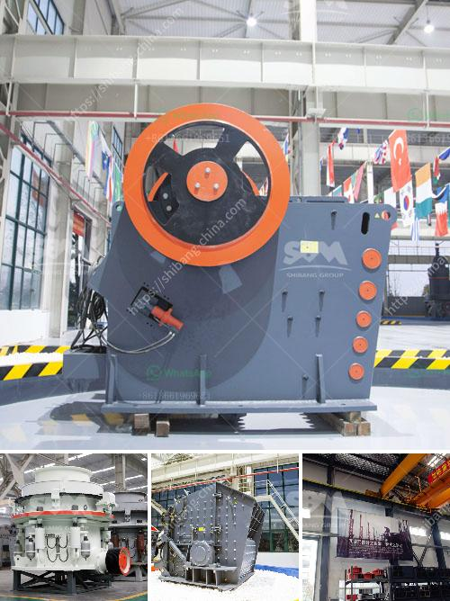

<h3>aggregate mining process</h3>
Aggregates are an essential component in the construction industry, serving as the raw material for concrete, asphalt, and other building materials. The process of mining these aggregates is crucial to ensure a steady supply of high-quality materials for various construction projects.

The aggregate mining process begins with the excavation of raw materials from a designated area, usually located near the construction site. The materials are then transported to a nearby processing plant where they undergo various crushing, screening, and sizing processes. These processes are designed to remove impurities and ensure that the aggregates meet the required specifications.

Once the aggregates are processed, they are ready to be used in construction projects. Larger-sized aggregates are typically used as base materials for roads, while smaller-sized aggregates are used for concrete production. The specific size and type of aggregates used depend on the intended application and engineering requirements.

Aggregate mining also involves the responsible management of the environment and resources. Mining operations must comply with environmental regulations to minimize their impact on nearby ecosystems, water sources, and communities. This involves implementing strategies such as dust control measures, soil erosion prevention, and water conservation practices.

Recently, there has been a growing trend towards sustainable aggregate mining practices. This includes the use of advanced technologies and equipment that reduce energy consumption and emissions. Furthermore, some companies are exploring alternative sources for aggregates, such as recycled materials or using waste products from other industries.

In conclusion, the aggregate mining process plays a significant role in meeting the demands of the construction industry. By ensuring a continuous supply of high-quality materials, construction projects can proceed without delays or compromises on safety and durability. As the industry continues to evolve, it is vital to adopt sustainable practices to minimize the environmental impact and maximize resource efficiency.
<h3>Contact us</h3><ul><li><strong>Whatsapp:&nbsp;<a href="https://wa.me/8613661969651">+8613661969651</a></strong></li><li><a href="https://swt.shibang-china.com/?git&amp;zhl&amp;aggregate mining process"><strong>Online Service(chat now)</strong></a></li></ul><h3>Related</h3><ul><li><a href='ultrafine vertical roller mill.md'>ultrafine vertical roller mill</a></li><li><a href='sale of stone hammer hammer.md'>sale of stone hammer hammer</a></li><li><a href='stone crusher machine price in kenya.md'>stone crusher machine price in kenya</a></li><li><a href='manufacturer of crushing plant malaysia.md'>manufacturer of crushing plant malaysia</a></li><li><a href='screening and crushing equipment for chrome.md'>screening and crushing equipment for chrome</a></li></ul>