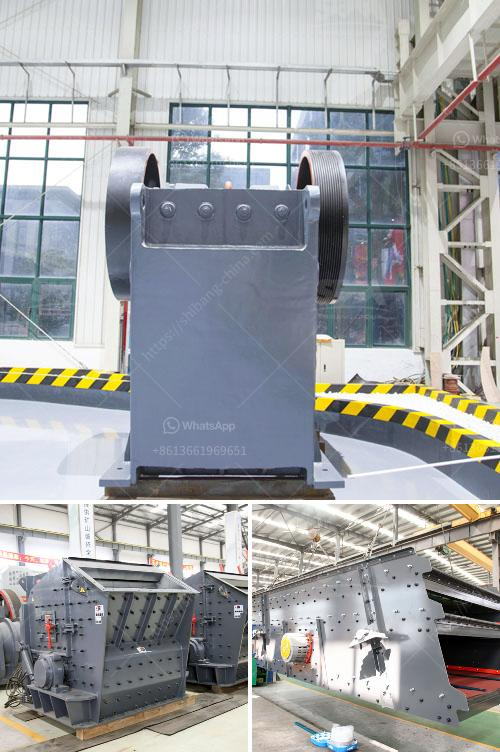

<h3>aggregate production plant pdf</h3>
A key aspect of any successful construction project is the reliable supply of high-quality aggregate materials. These materials, such as crushed stone, gravel, sand, and recycled concrete, serve as the foundation for various structures and are essential for creating strong, durable, and long-lasting infrastructure. To meet this demand, aggregate production plants play a crucial role in extracting, processing, and supplying a wide range of aggregate materials.

An aggregate production plant is a facility where various types of aggregate materials are produced by the process of crushing, screening, and washing. These plants are equipped with heavy-duty crushing equipment that allows them to break down and process large quantities of rock, stone, sand, gravel, and recycled concrete into smaller sizes suitable for various construction purposes.

One of the primary advantages of aggregate production plants is their ability to produce a wide range of aggregate materials to meet the specific needs of different construction projects. By utilizing various crushing and screening methods, these plants can produce a variety of sizes and types of aggregates, ensuring that contractors and builders have access to the materials they require. This flexibility allows for greater cost-effectiveness and efficiency in construction projects as materials can be tailored to meet specific project requirements.

Furthermore, aggregate production plants play a vital role in sustainable construction practices by incorporating recycled materials into their production processes. These plants are equipped to process and recycle concrete waste from demolished structures, turning it into usable aggregates. By recycling concrete waste, aggregate production plants reduce the demand for virgin materials and prevent the accumulation of construction waste in landfills, promoting environmental sustainability within the construction industry.

It is essential for aggregate production plants to prioritize safety and environmental responsibility. As these plants typically involve heavy machinery and high energy consumption, safety protocols and guidelines must be strictly followed to ensure the well-being of the workers and minimize accidents. Additionally, these plants must adhere to environmental regulations and employ measures to prevent air and water pollution, noise disturbances, and dust emissions.

In recent years, advancements in technology have significantly improved the efficiency and productivity of aggregate production plants. Automation systems, computer-controlled operations, and sophisticated equipment have made the process more streamlined and efficient, resulting in higher production rates and improved product quality. These advancements have also enhanced the precision of aggregate sizing and grading, ensuring that construction projects have access to consistent and reliable materials.

In conclusion, aggregate production plants are critical for the construction industry as they provide a consistent supply of high-quality aggregate materials. These plants extract, process, and supply various types of aggregates that form the foundation of different construction projects. By utilizing advanced technology and incorporating sustainable practices, these plants can meet the specific needs of construction projects while promoting environmental responsibility. As the construction industry continues to grow, aggregate production plants will play a vital role in meeting the demand for reliable and sustainable aggregate materials.
<h3>Contact us</h3><ul><li><strong>Whatsapp:&nbsp;<a href="https://wa.me/8613661969651">+8613661969651</a></strong></li><li><a href="https://swt.shibang-china.com/?git&amp;zhl&amp;aggregate production plant pdf"><strong>Online Service(chat now)</strong></a></li></ul><h3>Related</h3><ul><li><a href='sand crusher price water.md'>sand crusher price water</a></li><li><a href='calcium carbonate plant manufacturers.md'>calcium carbonate plant manufacturers</a></li><li><a href='iron crushing equipment.md'>iron crushing equipment</a></li><li><a href='coal screening machine for sale south africa.md'>coal screening machine for sale south africa</a></li><li><a href='graphite beneficiation plant for sale.md'>graphite beneficiation plant for sale</a></li></ul>