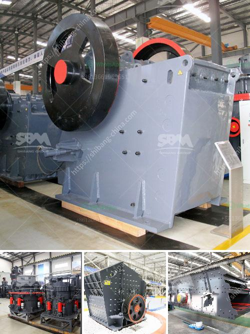

<h3>aggregate wash plant for sale</h3>
Aggregate wash plants are essential for producing clean and quality aggregates used in construction projects. These plants efficiently remove impurities and contaminants from the raw materials, ensuring that the final product meets the required specifications. If you are in the market for a reliable and efficient aggregate wash plant, there are numerous options available for sale.

An aggregate wash plant is a facility that processes materials such as sand, gravel, crushed stone, slag, or recycled concrete to create various sizes and types of aggregate products. These products are used in a wide range of construction applications, including concrete production, road base, and drainage systems.

When it comes to purchasing an aggregate wash plant, there are several factors to consider. One crucial aspect is the capacity of the plant. Depending on your project requirements, you need to determine how much material you will need to process on a daily or hourly basis. A wash plant with a higher processing capacity will be able to handle larger volumes of material, increasing productivity.

Another factor to consider is the type of washing system employed by the plant. There are various types of washing systems, including log washers, sand screws, and cyclones, each with its own advantages and limitations. Researching and understanding the different systems will help you select the one that best suits your needs and budget.

Efficiency is another essential aspect to consider when purchasing an aggregate wash plant. An efficient wash plant will separate and remove contaminants effectively, ensuring high-quality aggregates. Look for features such as multiple stages of washing, adjustable water pressure and flow rates, and screens or classifiers that accurately size the aggregates.

Maintenance and durability are crucial for any equipment, including aggregate wash plants. Choose a plant that is made from high-quality materials and has a robust construction. This will ensure that it can withstand the harsh conditions typically encountered in aggregate processing, such as high volumes of water, abrasive materials, and heavy loads.

When searching for an aggregate wash plant for sale, it is recommended to explore both new and used options. New plants offer the latest technology and may come with warranties, while used plants can be more cost-effective. However, with used plants, it is important to thoroughly inspect the equipment and ensure that it is in good working condition to avoid any unexpected repair costs.

Consider purchasing from reputable manufacturers or suppliers that have a track record of delivering reliable and high-quality equipment. Reading customer reviews and seeking recommendations from industry professionals can help you make an informed decision.

An effective aggregate wash plant is an investment that can greatly benefit construction projects by producing clean and high-quality aggregates. By considering the factors mentioned above and conducting thorough research, you can find the right plant for your needs. Take the time to evaluate all available options to ensure that you select a plant that offers the best value for money and meets your project requirements.
<h3>Contact us</h3><ul><li><strong>Whatsapp:&nbsp;<a href="https://wa.me/8613661969651">+8613661969651</a></strong></li><li><a href="https://swt.shibang-china.com/?git&amp;zhl&amp;aggregate wash plant for sale"><strong>Online Service(chat now)</strong></a></li></ul><h3>Related</h3><ul><li><a href='jaw crusher price philippines.md'>jaw crusher price philippines</a></li><li><a href='best marble grinder mill.md'>best marble grinder mill</a></li><li><a href='price list of used stone crusher in india.md'>price list of used stone crusher in india</a></li><li><a href='iron ore conveyor systems cost.md'>iron ore conveyor systems cost</a></li><li><a href='sand washing plant suppliers.md'>sand washing plant suppliers</a></li></ul>