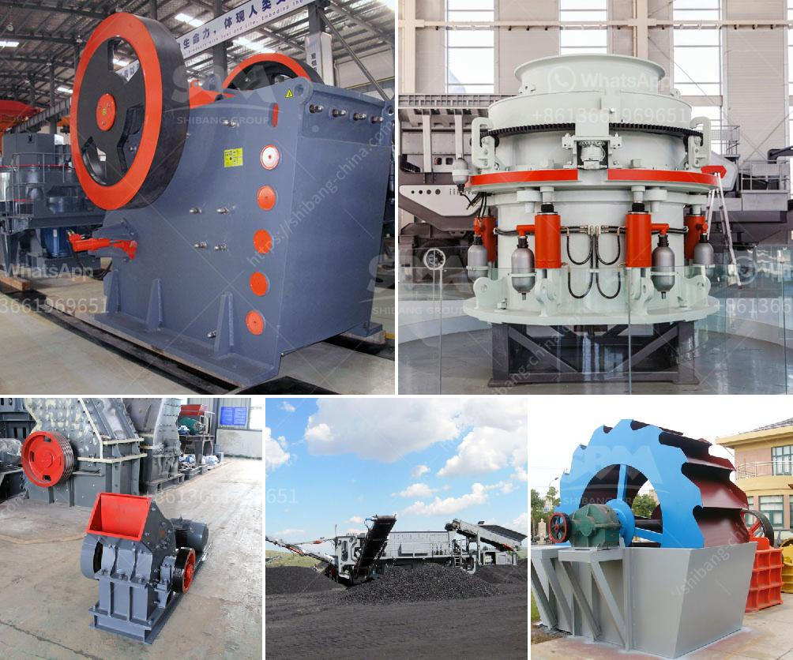

<h3>alluvia gold mining equipments</h3>
Alluvial gold mining has gained popularity over the years, and for a good reason. This type of mining lets individuals and small-scale miners gather gold particles from riverbeds, streambeds, and other similar sources. It requires minimal equipment and can be a lucrative venture for those armed with the right tools.

When it comes to alluvial gold mining equipment, several options are available to miners. These equipment are designed to efficiently extract gold particles from sediments or gravel, making the process easier and more productive. Here are some of the most commonly used alluvial gold mining equipments:

1. High Bankers: High bankers are an essential tool for any successful alluvial gold mining operation. These machines are essentially a combination of a sluice box and a water pump. The machine uses a tray filled with water and gravel to separate gold particles from other sediments. The water pump creates a constant flow of water that washes away lighter sediments, leaving the gold behind.

2. Trommels: Trommels are cylindrical drums that rotate as the miner feeds gravels and sediments into it. These machines have screens with varying sizes that help separate different-grained particles. The larger rocks and boulders are easily discarded, while smaller sediments containing gold particles drop through the mesh screens and are collected. Trommels are highly efficient at processing large amounts of material quickly.

3. Jigs: Jigs are gravity-based concentrators that are highly efficient in recovering gold. These machines work by pulsating water through a bed of sediments, forcing the heavier gold particles to settle while the lighter materials are washed away. Jigs are particularly useful in recovering fine gold particles that may have been missed by other equipment.

4. Sluice Boxes: Sluice boxes are perhaps the most well-known and commonly used equipment in alluvial gold mining. These long trough-like boxes are placed in running water, allowing the miner to shovel in sediments while the water flows through. The water washes away lighter materials, while gold particles sink to the bottom due to their weight. Sluice boxes can be customized with different riffle designs to maximize gold recovery.

5. Centrifugal Concentrators: Centrifugal concentrators make use of centrifugal force to concentrate gold particles. These machines spin at high speeds, creating a centrifugal force that pushes the heavier gold particles to the outer edge of the spinning bowl, while lighter materials are washed away. Centrifugal concentrators are highly efficient and are particularly effective in recovering fine gold particles.

It's important to note that these equipments are often used in combination to maximize gold recovery. Each equipment has its own advantages and limitations, and by combining them, miners can ensure a more efficient and productive operation. Proper maintenance and regular cleaning of the equipment are also crucial to maintain their effectiveness.

Alluvial gold mining can be a rewarding venture for those who have the right tools and knowledge. With the help of high bankers, trommels, jigs, sluice boxes, and centrifugal concentrators, miners can efficiently extract gold particles from sediments or gravels. Whether you're an individual looking to strike it rich or a small-scale miner seeking a sustainable income, investing in these essential equipments is a step towards success in alluvial gold mining.
<h3>Contact us</h3><ul><li><strong>Whatsapp:&nbsp;<a href="https://wa.me/8613661969651">+8613661969651</a></strong></li><li><a href="https://swt.shibang-china.com/?git&amp;zhl&amp;alluvia gold mining equipments"><strong>Online Service(chat now)</strong></a></li></ul><h3>Related</h3><ul><li><a href='stone crusher coalaries.md'>stone crusher coalaries</a></li><li><a href='dolomite processing plan in ethiopia.md'>dolomite processing plan in ethiopia</a></li><li><a href='ball mill for pigment.md'>ball mill for pigment</a></li><li><a href='how much price of ball mill.md'>how much price of ball mill</a></li><li><a href='sand wash plant hire perth.md'>sand wash plant hire perth</a></li></ul>