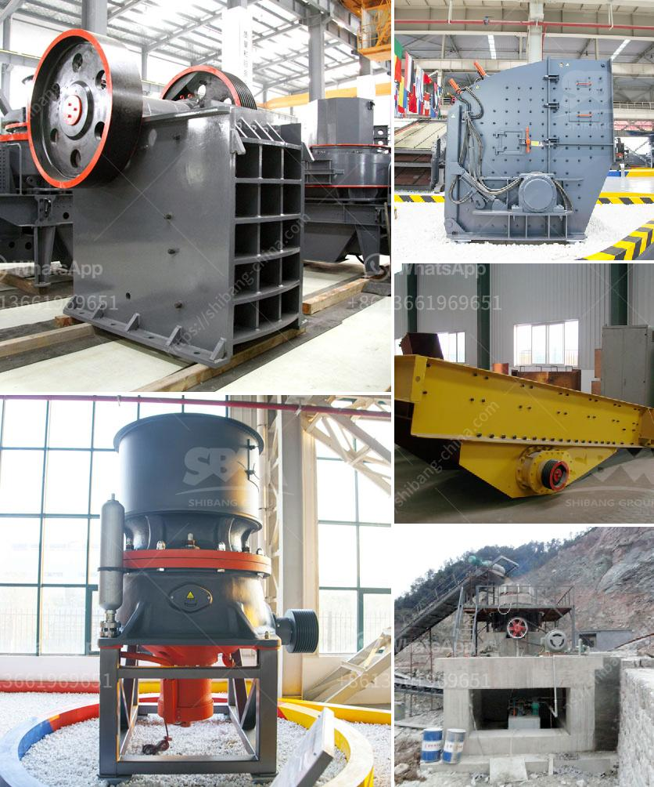

<h3>alluvial gold mining project proposal</h3>
Alluvial gold mining is the process of extracting gold from the alluvial deposits of rivers and streams. It is considered to be a modern-day gold rush, as many miners hope to find small flakes or nuggets of gold just as prospectors did in the past.

The proposed project seeks to mine shallow placer gold deposits in the Nhyira river located in the Central region of Ghana. The project will primarily focus on extracting gold from the alluvial deposits along the riverbanks and within the riverbed. This method of mining is considered to be environmentally-friendly as it does not involve the use of harmful chemicals like mercury or cyanide.

The project will involve the use of simple and low-cost mining equipment, such as excavators and trucks, to extract the alluvial gold. The extracted material will be processed using a combination of gravity separation and gold panning techniques to recover the gold particles.

The project comes with various benefits for both the miners and the local community. Firstly, it will create employment opportunities for many local residents who have limited alternative sources of income. This will contribute to poverty reduction and improve the overall livelihoods of the community.

Furthermore, the project will generate revenue for the local government through taxation and royalties. This additional income can be used to improve infrastructure, education, and healthcare facilities in the area, benefiting the entire community.

Environmental sustainability is a key aspect of the project proposal. Unlike other forms of gold mining, alluvial gold mining doesn't require extensive digging or excavation. This minimizes the disruption to the ecosystem and reduces the risks of soil erosion and water contamination.

The project will also include a comprehensive land reclamation plan, ensuring that the mined areas are restored to their original state once the extraction is complete. This will allow for the regeneration of vegetation and the restoration of natural habitats, preserving the biodiversity of the area.

To address potential social and environmental impacts, the project will engage in regular dialogue with the local community and seek their input and feedback. It will also involve relevant stakeholders, such as environmental organizations and government agencies, to ensure compliance with laws and regulations.

In conclusion, the proposed alluvial gold mining project in the Nhyira river presents a unique opportunity to extract gold using environmentally-friendly methods. It will generate employment and revenue for the community while minimizing the negative impacts on the environment. With proper planning and implementation, this project has the potential to be a sustainable source of income and contribute to the overall development of the region.
<h3>Contact us</h3><ul><li><strong>Whatsapp:&nbsp;<a href="https://wa.me/8613661969651">+8613661969651</a></strong></li><li><a href="https://swt.shibang-china.com/?git&amp;zhl&amp;alluvial gold mining project proposal"><strong>Online Service(chat now)</strong></a></li></ul><h3>Related</h3><ul><li><a href='100 tons hour gold wash plant.md'>100 tons hour gold wash plant</a></li><li><a href='aggregate mining process.md'>aggregate mining process</a></li><li><a href='iron ore beneficiation flowsheet.md'>iron ore beneficiation flowsheet</a></li><li><a href='trommel screen for sale south africa.md'>trommel screen for sale south africa</a></li><li><a href='jaw crusher c160 menghancurkan peralatan.md'>jaw crusher c160 menghancurkan peralatan</a></li></ul>