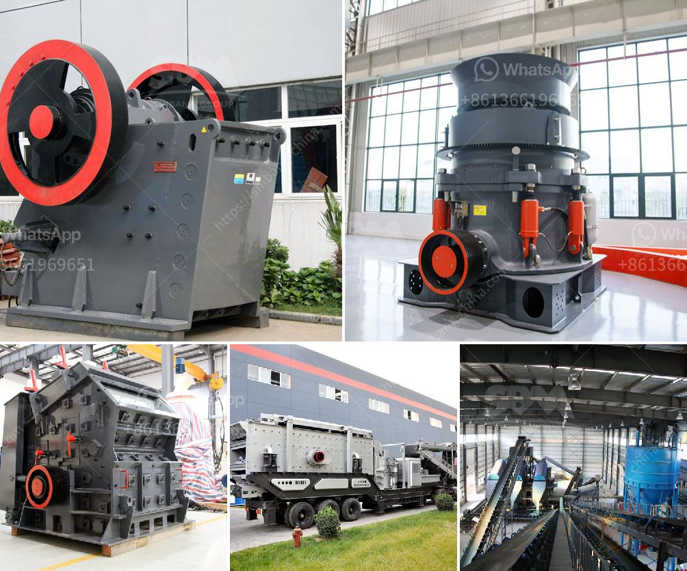

<h3>alluvial gold washing plant in zimbabwe</h3>
Alluvial gold washing plant in Zimbabwe is not only a rare and valuable resource, but also a potentially profitable investment for the market. The prices of gold are constantly fluctuating, and investors needs are varied. Some individuals and companies are interested in investing in gold for the long-term, while others are looking for short-term gains.

One of the most effective ways to extract gold from alluvial deposits is by using a gold wash plant. These plants are versatile and can be used in various mining operations. They are perfect for small-scale miners or prospectors who are looking to maximize their efficiency and recovery rates.

The alluvial gold washing plant in Zimbabwe is specifically designed for the recovery of silt, clay, and sand deposits that are left behind after the gold-bearing material is mined. This type of gold mining equipment is popular in many developing countries including Zimbabwe.

The alluvial gold washing plant in Zimbabwe consists of a hopper, a vibrating feeder, a rotary scrubber, a trommel screen, a sluice box, and a centrifugal concentrator. Each machine is designed with the industrial knowledge and expertise necessary to extract gold in the most efficient way possible.

The hopper is filled with the gold-bearing material, which is then fed into the vibrating feeder. The feeder evenly distributes the material onto the scrubber, which uses water and mechanical action to break up and wash away the clay and sand particles. This process removes the impurities, leaving behind clean gold-bearing material.

The material is then fed into the trommel screen, which rotates at a specific speed to separate the larger rocks and pebbles from the finer gold particles. The material that passes through the trommel screen is then directed into the sluice box, which utilizes water flow and riffles to trap and collect the gold particles. The sluice box is designed to ensure high recovery rates and prevent the loss of fine gold.

Once the material has passed through the sluice box, it is directed into the centrifugal concentrator. This machine uses centrifugal force to separate the gold from the lighter materials. The gold is collected in a separate container, while the waste material is directed out of the machine.

The alluvial gold washing plant in Zimbabwe is designed to be modular and can easily be adapted to fit the specific needs of the user. It can process large quantities of material at a relatively low cost, making it suitable for small-scale miners or prospectors.

Investing in a gold wash plant can be a profitable venture, especially in countries with high gold production potential like Zimbabwe. By utilizing modern technology and efficient mining equipment, individuals and companies can increase their gold recovery rates and maximize their profits. Whether it is for long-term investment or short-term gains, the alluvial gold washing plant in Zimbabwe offers a viable and efficient solution.
<h3>Contact us</h3><ul><li><strong>Whatsapp:&nbsp;<a href="https://wa.me/8613661969651">+8613661969651</a></strong></li><li><a href="https://swt.shibang-china.com/?git&amp;zhl&amp;alluvial gold washing plant in zimbabwe"><strong>Online Service(chat now)</strong></a></li></ul><h3>Related</h3><ul><li><a href='project of crushing and screening stone crusher machine.md'>project of crushing and screening stone crusher machine</a></li><li><a href='cost of gold bow mill for sale in south africa.md'>cost of gold bow mill for sale in south africa</a></li><li><a href='kaolin processing line.md'>kaolin processing line</a></li><li><a href='disintegrator grinder pulverizer.md'>disintegrator grinder pulverizer</a></li><li><a href='sand washing machine in ethiopia.md'>sand washing machine in ethiopia</a></li></ul>