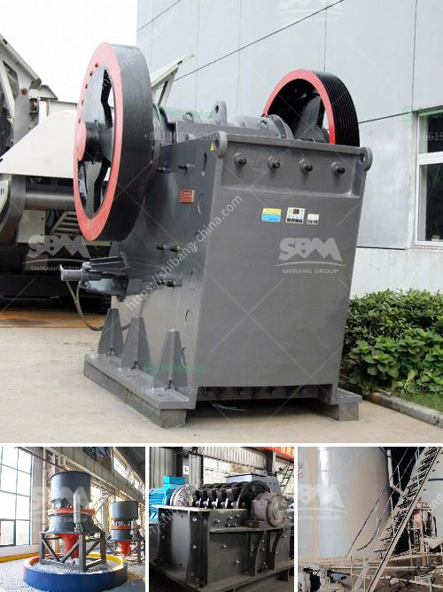

<h3>alluvial gold washing plants in south africa</h3>
Alluvial gold washing plants are the gold mining machines which are designed to remove the clay and gravel from the gold ore, creating a concentrated gold deposit. These plants are found in Africa and South America, especially in areas of lesser rainfall where the water supply is limited. In South Africa, alluvial gold is commonly found in rivers and streams, forming a rich deposit that is mined for the precious metal.

The alluvial gold washing plant plays an important role in mining gold. The plant is designed to remove the clay and gravel, offering a simpler process flow for the gold recovery. It reduces the labor work required during the gold washing process, saving time and effort. The plant can also be transported to different locations, allowing miners to explore various areas and maximize their gold recovery efforts.

One of the main benefits of using an alluvial gold washing plant is the low capital expenditure. These plants are relatively inexpensive to set up and operate, making them an attractive option for small-scale and artisanal gold miners in South Africa. The relatively low costs associated with alluvial gold washing plants make it feasible for individual miners to start their own operations and generate income from gold mining.

Additionally, alluvial gold washing plants are environmentally friendly. Compared to traditional mining methods, which often involve extensive excavation and the use of heavy machinery, these plants have a smaller footprint and do not require the same level of environmental disturbance. They do not involve chemical processes or the use of harmful substances, minimizing their impact on the local ecosystem.

The operation of an alluvial gold washing plant is relatively simple. Once the plant is set up near a gold-rich river or stream, the gold-bearing gravel is excavated and fed into the washing plant's hopper. The water supply, which may be sourced from a nearby river or brought in using tanks, is used to wash away the clay and gravel, leaving behind the concentrated gold particles.

The gold particles are then collected in riffles or mats, where they settle due to their higher density. The remaining water, which now contains less sediment, is discharged from the plant. The collected gold is further processed to separate any remaining impurities, ensuring a high-quality gold concentrate.

Alluvial gold washing plants have been an integral part of the gold mining industry in South Africa for over a century. Their simplicity and low capital expenditure make them ideal for small-scale and artisanal miners. These plants continue to play a crucial role in the country's gold mining industry, providing employment and income for thousands of individuals and contributing to the nation's economy.
<h3>Contact us</h3><ul><li><strong>Whatsapp:&nbsp;<a href="https://wa.me/8613661969651">+8613661969651</a></strong></li><li><a href="https://swt.shibang-china.com/?git&amp;zhl&amp;alluvial gold washing plants in south africa"><strong>Online Service(chat now)</strong></a></li></ul><h3>Related</h3><ul><li><a href='silica flour mill.md'>silica flour mill</a></li><li><a href='south africa coal mining cost per ton.md'>south africa coal mining cost per ton</a></li><li><a href='cost of gold bow mill for sale in south africa.md'>cost of gold bow mill for sale in south africa</a></li><li><a href='japan used rolling mill.md'>japan used rolling mill</a></li><li><a href='lime powder marking machines.md'>lime powder marking machines</a></li></ul>