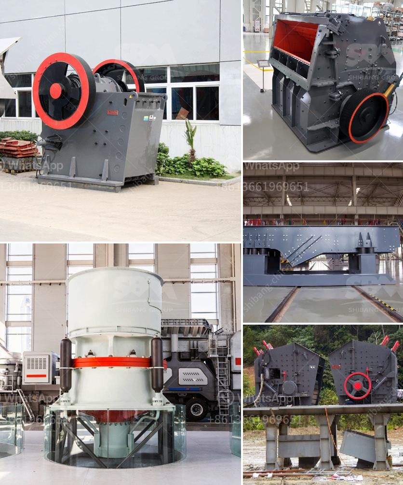

<h3>antimony processing plant in south africa</h3>
Antimony is a chemical element with the symbol Sb and atomic number 51. It is a lustrous gray metalloid that is found in nature in the sulfide mineral stibnite (Sb2S3). Antimony has a wide range of applications, including the manufacturing of flame-retardant materials, batteries, and ceramics. Due to its unique properties, the demand for antimony has been steadily increasing over the years.

South Africa is home to one of the largest antimony processing plants in the world. While antimony ore deposits are found across the globe, the majority of the world's known reserves are located in China. However, South Africa is unique as it possesses an estimated 12% of the world's reserves.

The antimony processing plant in South Africa is operated by Consolidated Murchison, which is owned by the Australian-listed company, Village Main Reef. The plant produces antimony concentrates through a flotation process, which involves crushing, grinding, and flotation. In this process, the ore is first crushed and ground to liberate the antimony minerals. The resulting concentrate is then floated, removing impurities and separating antimony minerals from other minerals in the ore.

The processed antimony concentrate is then sent to smelters for further refining. Smelting involves the heating of the concentrate to a high temperature, which causes the sulfur and other impurities to be oxidized and removed. This leaves behind a crude metallic antimony that is further purified to produce high-grade antimony metal.

The antimony processing plant in South Africa not only meets the domestic demand for antimony, but it also plays a significant role in the global antimony market. South Africa exports most of its antimony concentrates to countries like China, Belgium, and the United States.

In conclusion, the antimony processing plant in South Africa is a key player in the global antimony market. With its abundant reserves and advanced processing technology, South Africa has the potential to become a major antimony supplier to the world. This not only creates job opportunities for the local population but also contributes to the growth of the South African economy.
<h3>Contact us</h3><ul><li><strong>Whatsapp:&nbsp;<a href="https://wa.me/8613661969651">+8613661969651</a></strong></li><li><a href="https://swt.shibang-china.com/?git&amp;zhl&amp;antimony processing plant in south africa"><strong>Online Service(chat now)</strong></a></li></ul><h3>Related</h3><ul><li><a href='stone crusher permission maharashtra.md'>stone crusher permission maharashtra</a></li><li><a href='iron crushing equipment for sale.md'>iron crushing equipment for sale</a></li><li><a href='stationary jaw crusher.md'>stationary jaw crusher</a></li><li><a href='stone crushers nigeria.md'>stone crushers nigeria</a></li><li><a href='zinc ore suppliers in south africa.md'>zinc ore suppliers in south africa</a></li></ul>