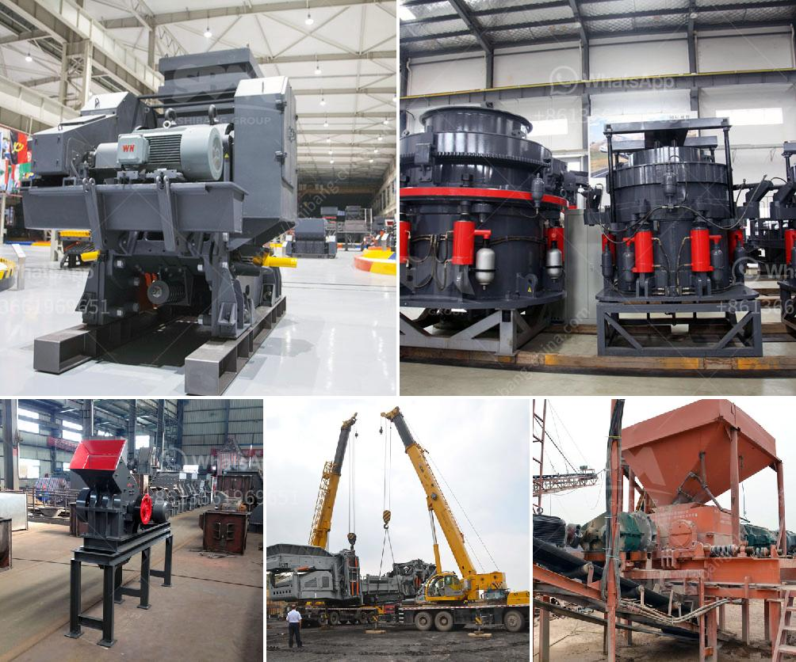

<h3>applied geochemistry for mica processing</h3>
Geochemistry plays a crucial role in the processing of minerals, including mica, a versatile mineral with applications in various industries. Mica is a group of sheet silicate minerals that have unique physical and chemical properties, making them essential in electrical, thermal, and mechanical applications. To extract and process mica efficiently, applied geochemistry techniques are employed at different stages, including exploration, mining, and beneficiation.

The first step in mica processing is exploration, where geochemical surveys are conducted to identify potential mica deposits. Various geochemical methods are utilized to determine the presence, distribution, and concentration of mica in the Earth's crust. Geochemical surveys, such as soil sampling, stream sediment sampling, and rock chip sampling, are carried out to analyze the elemental composition of the surrounding environment. These surveys help in identifying anomalous concentrations of elements associated with mica deposits, such as potassium (K), aluminum (Al), silicon (Si), and oxygen (O). By analyzing these geochemical signatures, geologists can narrow down prospective areas for mining activities.

Once a mica deposit is identified, mining operations commence. Here, geochemical analysis is used for the characterization and monitoring of mica-bearing rocks. Rock samples extracted from the mine site are subjected to various geochemical tests to determine their mineral composition, mineralogical associations, and geochemical zonation. This information is vital for the efficient planning of mining operations, such as determining the cutoff grades and designing appropriate extraction methods. Geochemical analysis also helps in evaluating rock stability, identifying potential hazards, and implementing safety measures to minimize risks associated with mining activity.

After mining, the mined ore undergoes beneficiation processes to extract valuable mica flakes with high purity. Geochemical techniques play a crucial role in ore beneficiation by facilitating the efficient separation of mica from gangue minerals. Froth flotation, a commonly used beneficiation technique, employs the differences in the surface properties of minerals to selectively separate them. Geochemical analysis of the mica ore helps in the selection of suitable collectors, frothers, and pH modifiers, leading to optimal flotation conditions for maximum mica recovery.

Furthermore, applied geochemistry assists in the refining and value addition of mica. Contaminants, such as iron oxides, titanium oxides, and other impurities, need to be removed to obtain high-quality mica products. Geochemical analysis identifies the impurities present in the mica concentrate, allowing targeted purification techniques to be employed. Techniques like magnetic separation or acid leaching can be applied to remove impurities, enhancing the purity and value of the final mica product.

In conclusion, applied geochemistry is integral to the extraction and processing of mica at various stages, ranging from exploration to refining. Through geochemical surveys, potential mica deposits can be identified, while geochemical analysis of mined ore aids in planning mining operations and ensuring safety. Additionally, geochemical techniques enable the efficient separation of mica during beneficiation processes, leading to high-quality mica products. By leveraging geochemical knowledge and techniques, the mica industry can optimize its operations, increase productivity, and meet the demands of multiple industries that rely on mica's unique properties.
<h3>Contact us</h3><ul><li><strong>Whatsapp:&nbsp;<a href="https://wa.me/8613661969651">+8613661969651</a></strong></li><li><a href="https://swt.shibang-china.com/?git&amp;zhl&amp;applied geochemistry for mica processing"><strong>Online Service(chat now)</strong></a></li></ul><h3>Related</h3><ul><li><a href='suppliers of ld slag crushing plants in india.md'>suppliers of ld slag crushing plants in india</a></li><li><a href='costruire une machine pour broyer des briques.md'>costruire une machine pour broyer des briques</a></li><li><a href='crushing plant for sale.md'>crushing plant for sale</a></li><li><a href='small conveyor belt to move coal for home use.md'>small conveyor belt to move coal for home use</a></li><li><a href='quarry stone business plan in zimbabwe.md'>quarry stone business plan in zimbabwe</a></li></ul>