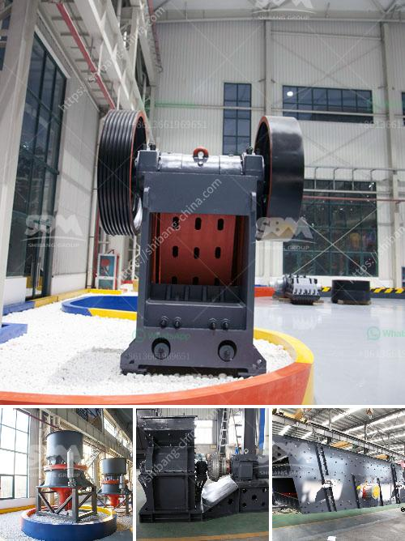

<h3>artificial marble crusher machinery</h3>
Artificial marble, commonly referred to as cultured marble, provides the look and feel of genuine marble without the extravagant cost. It is crafted by combining natural marble chips with resins and pigments to create a durable material that can be molded into various shapes and sizes. Artificial marble has gained immense popularity in the construction industry due to its versatility, affordability, and easy maintenance.

To produce artificial marble, one needs to invest in specialized machinery that can crush and grind the natural marble chips into desired shapes and sizes. This process is essential as it ensures the uniformity and quality of the artificial marble. The machinery used for crushing and grinding needs to be reliable, efficient, and capable of processing large quantities of marble chips.

One such machinery that aids in the production of artificial marble is the crusher. Crushed marble chips are then screened and classified by size. This process ensures that all the marble chips meet the required specifications and are of consistent quality. After the screening process, the marble chips are sent to the grinding machine, which grinds them to the desired shape and size.

The crusher machinery used in artificial marble production is not only robust and efficient but also requires less maintenance. This makes it ideal for large-scale production facilities. Investing in such machinery can be a game-changer for businesses involved in the artificial marble industry as it significantly reduces labor costs and increases productivity.

Another important aspect of the crusher machinery used in artificial marble production is the ability to control the final product's color and texture. With advanced technology, it is now possible to customize the color and veining of the artificial marble, providing architects and designers with endless possibilities for creative projects.

In addition to its aesthetic appeal, artificial marble is also environmentally friendly. The production process minimizes waste, as any leftover material can be recycled and reconstituted into new products. Furthermore, artificial marble is non-porous, making it resistant to stains, scratches, and cracks. This durability and easy maintenance make it an ideal choice for various applications in residential and commercial buildings.

The demand for artificial marble has been steadily increasing, as consumers look for cost-effective alternatives to natural marble. With advancements in crusher machinery, the production of artificial marble has become more efficient, enabling manufacturers to meet the market's growing demands.

In conclusion, artificial marble crusher machinery plays a crucial role in the production of artificial marble. It enables manufacturers to crush and grind marble chips to produce high-quality, customizable artificial marble. With its affordability, versatility, and easy maintenance, artificial marble has become a popular choice in the construction industry. Investing in reliable and efficient crusher machinery can revolutionize the production process, enhancing productivity and reducing costs for businesses involved in the artificial marble industry.
<h3>Contact us</h3><ul><li><strong>Whatsapp:&nbsp;<a href="https://wa.me/8613661969651">+8613661969651</a></strong></li><li><a href="https://swt.shibang-china.com/?git&amp;zhl&amp;artificial marble crusher machinery"><strong>Online Service(chat now)</strong></a></li></ul><h3>Related</h3><ul><li><a href='cone crushers manufacturer.md'>cone crushers manufacturer</a></li><li><a href='mobile cone crusher hire malaysia.md'>mobile cone crusher hire malaysia</a></li><li><a href='grinding machine made in turkey.md'>grinding machine made in turkey</a></li><li><a href='quarry crusher equipment china.md'>quarry crusher equipment china</a></li><li><a href='quarry machine manufacturers.md'>quarry machine manufacturers</a></li></ul>