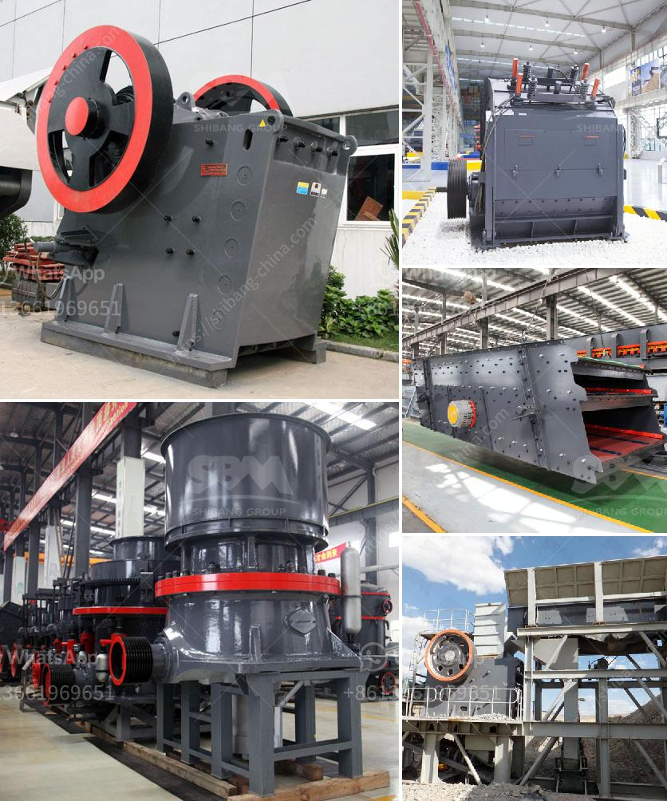

<h3>artificial sand making in karnataka</h3>
Artificial sand has brought a revolution in the construction industry. Karnataka is one of the states in India where this revolutionary technology is being used extensively. From small scale construction projects to mega infrastructure development, artificial sand is being used as an alternative to natural sand in Karnataka.

The availability of natural sand is limited in Karnataka due to the depletion of river beds and illegal sand mining. The excessive demand for sand in the construction industry has led to soaring prices and environmental damage. To address these issues, the Karnataka government has encouraged the use of artificial sand.

Artificial sand is produced by crushing rocks, quarry stones or larger aggregates pieces into sand-sized particles. The sand is then screened, washed and graded to produce the desired specifications. The artificial sand comes with certain key advantages and benefits over natural sand, such as durability, workability, shape, and overall cost-effectiveness.

One of the major benefits of artificial sand is that it is free from impurities such as silt, clay, and organic matter. This ensures that the sand used in construction is of high quality and does not affect the strength and durability of the structures. Moreover, artificial sand can be produced to have a specific shape and size, which helps in achieving the desired texture and finish for various construction purposes.

The use of artificial sand in Karnataka has significantly reduced the demand for natural sand, thereby reducing the environmental impact of sand mining and preserving the river beds. It has also helped in bridging the gap between demand and supply, resulting in stabilized sand prices.

The Karnataka government has taken several initiatives to promote the use of artificial sand. It has provided incentives and subsidies for setting up artificial sand manufacturing units, making it an attractive option for entrepreneurs and investors. Additionally, awareness campaigns and workshops have been conducted to educate builders, contractors, and other stakeholders about the benefits and process of using artificial sand.

In conclusion, the use of artificial sand in Karnataka has proved to be a game-changer in the construction industry. It has helped in addressing the issues of sand scarcity, environmental damage, and skyrocketing prices. With the government's support and the growing acceptance among stakeholders, the artificial sand industry in Karnataka is poised for further growth and development.
<h3>Contact us</h3><ul><li><strong>Whatsapp:&nbsp;<a href="https://wa.me/8613661969651">+8613661969651</a></strong></li><li><a href="https://swt.shibang-china.com/?git&amp;zhl&amp;artificial sand making in karnataka"><strong>Online Service(chat now)</strong></a></li></ul><h3>Related</h3><ul><li><a href='price rock crusher.md'>price rock crusher</a></li><li><a href='river pebble crusher manufacturer.md'>river pebble crusher manufacturer</a></li><li><a href='jaw crusher south africa.md'>jaw crusher south africa</a></li><li><a href='gemstones found in nigeria.md'>gemstones found in nigeria</a></li><li><a href='limestone mines for sale in cambodia.md'>limestone mines for sale in cambodia</a></li></ul>