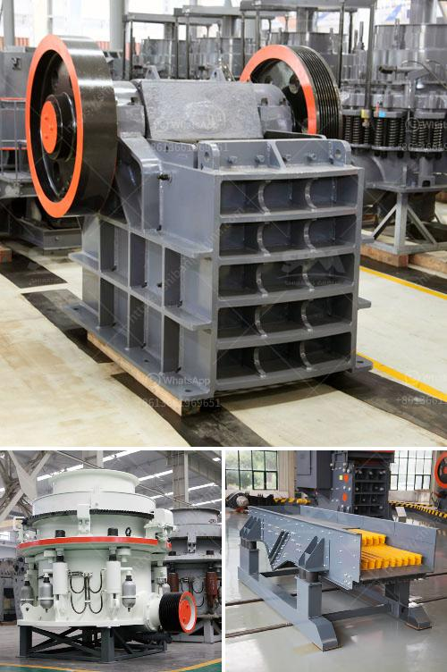

<h3>asphalt crushing machine capacity 15 ton hour</h3>
When it comes to recycling asphalt, the process can sometimes be complex and challenging. However, with the introduction of asphalt crushing machines, the game has completely changed. These machines are capable of crushing asphalt into smaller pieces with a capacity of 15 tons per hour.

The asphalt crushing machine converts the asphalt rubble into recycled asphalt pavement (RAP), an alternative to traditional asphalt. RAP can be reused for new asphalt construction projects or used as a base layer and sub-base material. Not only does this benefit the environment by reducing the need for new asphalt production, but it also saves costs for companies involved in asphalt construction and maintenance.

One of the key advantages of the asphalt crushing machine is its high capacity of 15 tons per hour. This allows for efficient processing of large amounts of asphalt rubble, reducing the time it takes to complete a project. With a higher capacity, companies can tackle larger projects and increase their overall productivity.

The machine is also designed to handle various sizes of asphalt rubble. Its crushing mechanism reduces the asphalt into smaller pieces, ensuring they fit the required specifications for recycling or reuse. This versatility makes it suitable for both residential and commercial asphalt projects.

Moreover, the asphalt crushing machine is equipped with advanced technologies that enhance its efficiency and performance. It comes with a powerful engine, ensuring smooth and consistent operation. The machine's low fuel consumption and emission levels make it an environmentally friendly option for asphalt recycling.

The asphalt crushing machine is also easy to operate and maintain. Its user-friendly interface allows operators to control and monitor the machine efficiently. Regular maintenance checks and minimal downtime ensure that the machine remains in optimal condition, providing continuous and reliable service over time.

In addition to its impressive capacity, the machine offers a cost-effective solution for asphalt recycling. By crushing and recycling asphalt on-site, companies can save on transportation costs and reduce the need for new asphalt production. This not only benefits their bottom line but also contributes to a more sustainable and eco-friendly approach to asphalt construction.

Asphalt crushing machines with a capacity of 15 tons per hour are transforming the way companies approach asphalt recycling. With their high capacity, efficiency, and cost-effectiveness, these machines are game-changers in the asphalt industry. By converting asphalt rubble into reusable material, they contribute to a more sustainable and environmentally friendly construction sector. As the demand for asphalt recycling continues to grow, these machines are poised to play a crucial role in meeting this demand and shaping the future of the industry.
<h3>Contact us</h3><ul><li><strong>Whatsapp:&nbsp;<a href="https://wa.me/8613661969651">+8613661969651</a></strong></li><li><a href="https://swt.shibang-china.com/?git&amp;zhl&amp;asphalt crushing machine capacity 15 ton hour"><strong>Online Service(chat now)</strong></a></li></ul><h3>Related</h3><ul><li><a href='crushing machine for chromium and chromite ore.md'>crushing machine for chromium and chromite ore</a></li><li><a href='stone crushers for sale in riyadh.md'>stone crushers for sale in riyadh</a></li><li><a href='gold mill for sale in zimbabwe.md'>gold mill for sale in zimbabwe</a></li><li><a href='price of ball mill for sale.md'>price of ball mill for sale</a></li><li><a href='gypsum grinding machine manufacturer in india.md'>gypsum grinding machine manufacturer in india</a></li></ul>