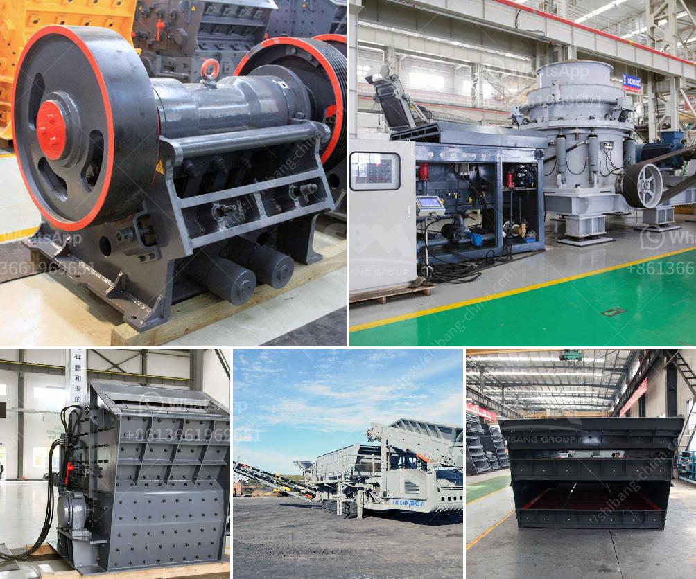

<h3>balast crashing machine dealers in uae</h3>
Searching for a reliable and efficient balast crashing machine dealer in the UAE? Look no further! The UAE is home to several reputable dealers offering a wide range of top-quality balast crashing machines. These machines are essential in various industries such as construction, mining, and road paving, as they crush stones and rocks into smaller, more manageable sizes for various applications.

One of the prominent balast crashing machine dealers in the UAE is known for delivering highly efficient and heavy-duty machines. Their machines are manufactured using the latest technology and are designed to withstand the harshest working conditions. With a team of skilled professionals and exceptional after-sales service, this dealer ensures that their clients receive the best value for their investment.

Their range of balast crashing machines caters to different project requirements and specifications. From compact machines suitable for small construction sites to robust and powerful crushers used in large-scale mining operations, they have it all. Additionally, their machines are equipped with advanced features such as remote control operation, easy maintenance, and high production capacity, making them extremely user-friendly.

The dealer also places great emphasis on providing reliable customer support and service. They understand that downtime can be costly for businesses, so they offer prompt technical assistance and spare parts availability to ensure uninterrupted machine operation. Moreover, their team of professionals is readily available to provide guidance and advice on selecting the most suitable balast crashing machine for a specific application.

Furthermore, this reputable dealer offers competitive prices, making their machines accessible to businesses of all sizes. They believe in building long-term relationships with their clients, prioritizing customer satisfaction above all else.

In conclusion, when it comes to balast crashing machines, the UAE has a handful of reliable dealers to choose from. These dealers offer top-quality machines, exceptional customer support, and competitive prices. So, whether you are in the construction, mining, or road paving industry, investing in a balast crashing machine from a reputable dealer in the UAE is a decision that will pay off in the long run.
<h3>Contact us</h3><ul><li><strong>Whatsapp:&nbsp;<a href="https://wa.me/8613661969651">+8613661969651</a></strong></li><li><a href="https://swt.shibang-china.com/?git&amp;zhl&amp;balast crashing machine dealers in uae"><strong>Online Service(chat now)</strong></a></li></ul><h3>Related</h3><ul><li><a href='used coal power plant for sale.md'>used coal power plant for sale</a></li><li><a href='grinder machine parts and function.md'>grinder machine parts and function</a></li><li><a href='quartz stone powder manufacturing plant in india.md'>quartz stone powder manufacturing plant in india</a></li><li><a href='crushing and screening plant supplier china.md'>crushing and screening plant supplier china</a></li><li><a href='3 4 inch crushed limestone.md'>3 4 inch crushed limestone</a></li></ul>