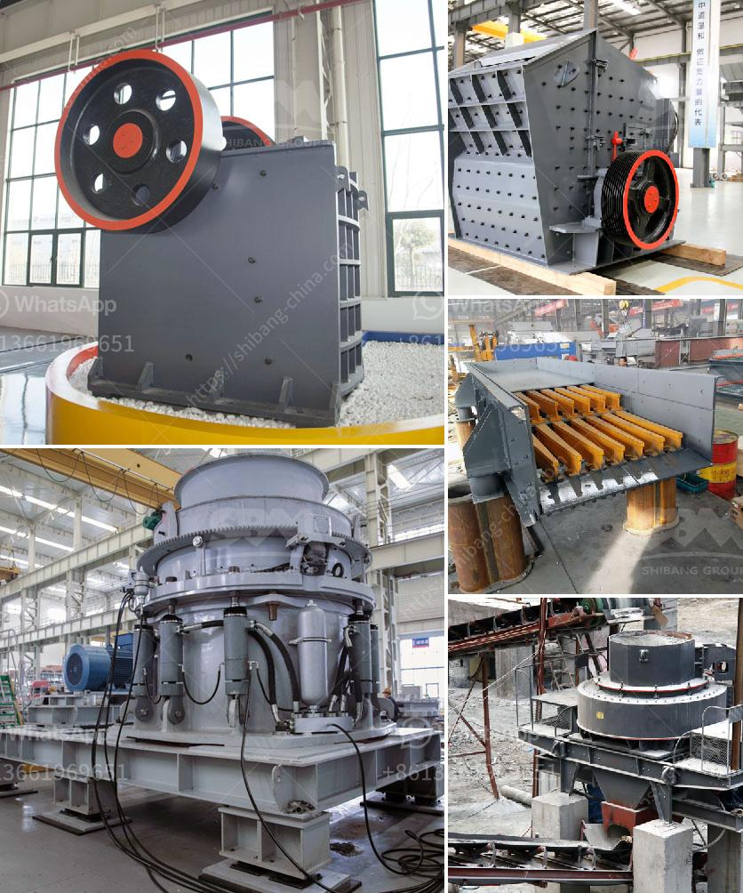

<h3>ball grinding machine manufacturer in india</h3>
India is one of the leading manufacturers and exporters of ball grinding machines. From small scale industry to large balls and steel grinding media, they cater to various industries such as mining, cement, ceramics, and glass manufacturing.

Ball grinding machines, also known as grinding mills, are used to grind various materials into extremely fine powder. These mills are widely used in the mining industry, cement industry, power plants, metallurgy, chemical industry, and other fields. The grinding process is used to reduce the size of the material by impacting and grinding it to enhance its milling and smoothening properties.

In India, there are several ball grinding machine manufacturers, who provide high-quality equipment to the industries as per their requirements. These manufacturers have established their strong presence in the market due to their unmatched expertise and continuous innovation to meet customer demands.

One of the renowned ball grinding machine manufacturers in India is Patel Technomation Pvt. Ltd. This company has been serving the industry for more than 30 years and has been providing top-notch quality machines at affordable prices. They have a dedicated team of engineers and technicians who strive to deliver exceptional products that offer longevity and efficiency.

Patel Technomation Pvt. Ltd offers a wide range of ball grinding machines, including laboratory ball mills, industrial ball mills, vibratory disc mills, and planetary ball mills. These machines are equipped with advanced features and technologies, such as high-speed rotation, variable speed settings, and programmable control systems, ensuring precise and accurate grinding operations. They also provide customized solutions to meet specific requirements of their customers.

Another prominent player in the market is Techno Designs India. With decades of experience in the field of ball grinding machines, they have gained a strong foothold in the industry. Techno Designs India offers a range of ball mills, such as wet grinding ball mills, dry grinding ball mills, batch type ball mills, continuous type ball mills, and many others. Their ball grinding machines are known for their robust construction, durability, and high performance.

Apart from Patel Technomation Pvt. Ltd and Techno Designs India, there are several other manufacturers in India providing ball grinding machines. These manufacturers focus on continuous research and development to stay ahead in the competitive market. They constantly strive to improve their products by incorporating the latest technologies, such as automation and digital control systems, to enhance the efficiency and productivity of the grinding process.

In conclusion, India has emerged as a leading manufacturer of ball grinding machines, catering to various industries globally. These manufacturers provide technologically advanced machines that offer precise and efficient grinding operations. Their commitment to quality, continuous innovation, and customer satisfaction has made them a preferred choice in the industry. With their wide range of products and customization options, these manufacturers are well-equipped to meet the diverse needs of their customers.
<h3>Contact us</h3><ul><li><strong>Whatsapp:&nbsp;<a href="https://wa.me/8613661969651">+8613661969651</a></strong></li><li><a href="https://swt.shibang-china.com/?git&amp;zhl&amp;ball grinding machine manufacturer in india"><strong>Online Service(chat now)</strong></a></li></ul><h3>Related</h3><ul><li><a href='industrial grinding plant.md'>industrial grinding plant</a></li><li><a href='cement ball mill cement mill for sale.md'>cement ball mill cement mill for sale</a></li><li><a href='diamond mining plant layout.md'>diamond mining plant layout</a></li><li><a href='how to start a crushing plant.md'>how to start a crushing plant</a></li><li><a href='how much does a mobile crusher cost.md'>how much does a mobile crusher cost</a></li></ul>