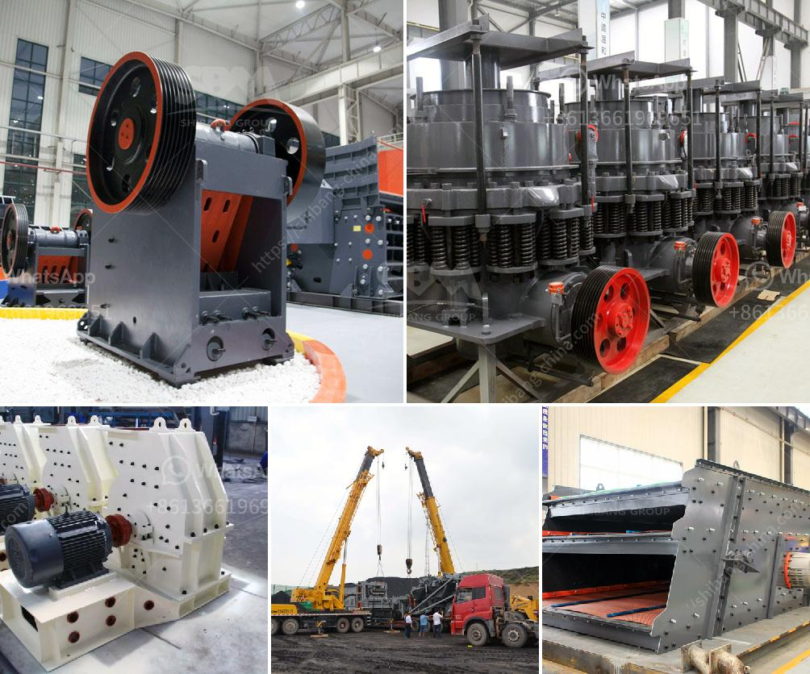

<h3>ball mill 20 ton</h3>
A ball mill 20 tons per hour capacity is commonly used in the grinding process. The mill consists of a cylindrical drum, sometimes tapered at one end, and usually has a charge of steel balls (up to 40% by volume) ranging in size up to 125mm for larger mills. Product size can be as small as 0.005mm, but is more commonly between 0.025 and 0.1mm.

The ball mill is a key equipment in the grinding process. It is widely used in cement, silicate products, new building materials, refractory materials, fertilizers, black and non-ferrous metal beneficiation, and glass ceramics. It can grind various ores and other materials either wet or dry.

The milling process involves the impact of the steel balls against the materials to be ground. The rotation of the mill cylinder creates centrifugal forces that bring the steel balls to the mill's height. The falling balls cause the materials to be grounded. As the mill rotates, the balls cascade and grind the ore. The final product exits the mill through a discharge grate, which prevents oversized particles from leaving the mill.

A ball mill with a capacity of 20 tons is especially suitable for the grinding of brittle or hard materials. It is also suitable for coarse grinding and overflow system in mineral processing industry, cement industry, etc. When the ball mill is in a wet grinding state, the input quantity of material is larger, and the higher the water content, the lower the output per unit time. Conversely, in the dry grinding state, the input quantity of material is smaller, and the lower the water content, the higher the output per unit time.

In conclusion, a ball mill 20 tons per hour capacity is a versatile milling machine with a wide range of applications in various industries. It is suitable for grinding various ores and other materials, whether wet or dry. Its high efficiency and large capacity make it an ideal choice for large-scale production.
<h3>Contact us</h3><ul><li><strong>Whatsapp:&nbsp;<a href="https://wa.me/8613661969651">+8613661969651</a></strong></li><li><a href="https://swt.shibang-china.com/?git&amp;zhl&amp;ball mill 20 ton"><strong>Online Service(chat now)</strong></a></li></ul><h3>Related</h3><ul><li><a href='marble stone milling plant manufacturer.md'>marble stone milling plant manufacturer</a></li><li><a href='ballast processing.md'>ballast processing</a></li><li><a href='quarry stone business plan in zimbabwe.md'>quarry stone business plan in zimbabwe</a></li><li><a href='project proposal on stone crushing plant.md'>project proposal on stone crushing plant</a></li><li><a href='print hammer mill.md'>print hammer mill</a></li></ul>